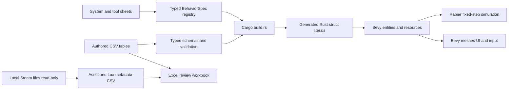

# Rust Workshop

Independent **Bevy 0.16.1 + Rapier 0.30** sandbox foundation, with spreadsheet-authored data and a Garry's Mod parity research catalog.

**This is not a complete Garry's Mod replacement, a Source port, or a Lua-compatible engine.** It is a working first implementation plus an explicit roadmap. No proprietary assets or Valve/Facepunch implementation code are bundled.

## What's New and what to test

Latest tool integration adds **Eye Poser, Face Poser, Finger Poser and Inflator subsets** using original model data on compatible props, with undo, duplication and version-6 saves. F7 lists exact checks and limits. All 34 player-facing stock tools plus custom Freeze now have partial routes, not complete native behavior. [The 19-report review](sheets/feedback_review.csv) and [52 tool checks](sheets/tool_cases.csv) remain unaccepted.

Earlier handling integration: **V flight + Shift boost / Alt precision**, and **hold RMB to aim with recoil on all eight enabled guns**. Aiming temporarily uses first person and returns to the selected F4 view on release. These are sheet-authored custom handling features, not full native secondary-fire parity or accepted iron-sight alignment. [The complete 18-report review](sheets/feedback_review.csv), [detailed implementation plan](docs/FEEDBACK_REVIEW_PLAN.md) and [20 manual handling cases](sheets/weapon_handling_cases.csv) keep older unfinished requests visible.

Press **F7** or click **What's New / Test Checklist** in the startup menu, pause menu or gameplay HUD. Twenty-nine sheet-authored cards explain changes, exact checks, expected behavior and known limits. Personal checkmarks persist locally, and each card can open contextual feedback. F7/Escape returns to the previous screen. **F8** opens one feedback note, with an embedded Windows editable field for your existing **Win+H** shortcut, caret editing, selection, clipboard and undo. No external editor or in-game speech engine is introduced. Windows owns its listening UI and speech privacy settings. End-to-end dictation and focus still need your acceptance. The [review plan](docs/FEEDBACK_REVIEW_PLAN.md) also covers original weapon clip corrections and categorized icon cards. These changes require Drew's interaction checks; checkmarks never mark project tests as passed.

Latest feedback integration adds **Ctrl crouch/jump-crouch**, original crouch poses, generic bullet impact marks, Jeep/Jalopy/APC wheel roll and steering, contact-triggered crash bursts, and live **FPS / health / ammo** readouts. Four new F7 cards explain what to check. These are partial implementations awaiting Drew's acceptance, not one-to-one Source behavior. [19 manual cases](sheets/motion_impact_cases.csv) document the boundaries.

The latest follow-up repairs the wheel coordinate basis and crouch speed lock, adds **E + mouse rotation while holding LMB**, bone-merges third-person weapons with player movement, and replaces ring-biased bullet spread. [The ten-row follow-up sheet](sheets/feedback_followup.csv) also tracks the still-missing full tool coverage, sounds, aiming modes, general prop-impact feedback and ragdolls. These repairs require your gameplay checks.

## NPC lifecycle continuation

Six NPC registrations now have typed ground-actor routes, researched original animation mappings, collision and visibility-gated prototype combat. All 85 registrations have explicit authored coverage, with 79 still disabled. Local player health/death/respawn, two NPC controls and version-4 typed scenes are integrated. Player sweeps now respect the No Collide tool's world-only collision mask. These changes are not gameplay-accepted. See [the remaining dependency plan](docs/REMAINING_PARITY_PLAN.md) and [21 acceptance cases](sheets/npc_cases.csv). Native navigation, equipment, sounds, ragdolls and the wider parity backlog remain open.

## Latest reported corrections

Vehicle spawn/drive/seat/camera headings now use researched original model frames instead of assuming every vehicle faces the same mesh axis. The model browser uses 8,390 original stock memberships with parent groups and focused branch navigation. Water now uses original moving normal maps and Bevy transmissive PBR rather than flat unlit fog color. These corrections are implemented, not gameplay-accepted. Native reflection, underwater fog, full vehicle simulation and the wider backlog remain incomplete. See [the correction plan](docs/VEHICLE_WATER_CATEGORY_PLAN.md).

## Continue development

- **[Download the complete review workbook](spreadsheets/rust-sandbox-catalog-20260930-posers.xlsx)**: includes the 169-root-gap backlog, 197 spawn references, 56 detailed capabilities, all 34 weapon, 15 vehicle and 85 NPC runtime coverage rows, menu research, and per-registration Drew-owned acceptance. Use GitHub's **Download raw file** button for Excel/LibreOffice.
- **[Spreadsheet contributor guide](spreadsheets/README.md)**: where to edit, validate, rebuild and regenerate the workbook.
- **[Remaining feature inventory](sheets/parity_gaps.csv)**: 169 missing/partial/unverified entries covering every cataloged system and tool, with priorities and acceptance checks. Includes nonmatching menus and remaining physgun fidelity gaps.
- **[Ordered implementation queue](sheets/work_queue.csv)**: dependency-ordered work packages assign every known gap exactly once. The first effects slice is implemented, not reference-equivalent.
- **[Authored CSV sheets](sheets/)** and **[public metadata catalogs](catalogs/stock-20260929/)**: all workbook inputs are tracked. No private local files or original game payloads are needed to inspect or export the data.

The gap inventory covers the current stock-game discovery catalog, not every possible native option or community addon. A reference row is not proof of implemented behavior or one-to-one parity.

### Click-to-equip weapons and typed vehicles

[Integration plan](docs/PLAYABLE_ENTITIES_PLAN.md), [weapon routes](sheets/source_weapons.csv), [vehicle tuning and poses](sheets/source_vehicles.csv), [shared gameplay tuning](sheets/source_gameplay.csv), and [49-row coverage/acceptance view](sheets/playable_coverage.csv). The eight creation tabs now keep **primary Equip/Spawn** separate from **Details / F8**.

- Thirteen weapon routes: existing physgun/toolgun plus prototype pistol, .357, SMG, AR2, shotgun, crossbow, RPG, grenade, crowbar, stunstick and flechette primary behavior. Click equips; release the mouse before firing. LMB attacks and R reloads. Session ammo survives switching. Ordinary spawned props can take damage and be destroyed. Projectiles use swept ray collision with visible debug shapes, not native projectile models/effects.
- All fifteen registered vehicle/seat entries have typed spawn routes and E entry/exit. Jeep, Jalopy and APC have prototype ray-supported chassis drive. Airboat adds support against mapped horizontal water triangles. WASD drives/reverses/steers, Space brakes, E exits and F4 changes view. Eleven pod/chair/seat entries are passive seats, not cars with invented engines.
- Original seated clips blend during entry/exit. This is a generic transition, **not native vehicle-specific entry/door animations or IK**. Attachment-driven wheel roll/steer exists for the three cars, but native pose parameters, suspension/engine tuning, sounds and crash damage remain missing. Native weapon secondary actions and 21 other weapon entries remain explicitly pending. Asset/clip failures are reported with rollback or documented pose fallback.
- Version-3 local scenes retain typed vehicle identities and prop health through save/load/undo/duplication and still accept version-2/legacy prop saves. Full native saves and persistent weapon inventory are not implemented. No gameplay or animation acceptance has been run by the agent; Drew owns testing.

### Current placement, feedback and menu implementation

[Detailed plan](docs/FRONTEND_PLAN.md), [runtime dimensions](sheets/source_frontend.csv), and [38 acceptance scenarios](sheets/frontend_cases.csv). Prop origins are offset using model support points at the aimed surface. Normal launch opens the main menu, with Start New Game and authored map selection. Escape opens a separate pause menu. **F8 / Detailed Feedback** records local drafts and structured reports under `local/feedback/*.json` for Jcode to review on your next request. Nothing is uploaded automatically. Menu/F10 exits offer scene saving or cancellation. Stock appearance, complete options and full one-to-one behavior remain unfinished. Drew performs all testing.

### Current toolgun implementation

[Implementation plan](docs/TOOLS_IMPLEMENTATION_PLAN.md), [runtime tool matrix](sheets/source_tools.csv), [178 editable option rows](sheets/source_tool_options.csv), and [Drew's 52 acceptance cases](sheets/tool_cases.csv). **34 stock tools plus custom Freeze have partial implementations**. Construction tools use typed devices, actual forces/joints, lighting and bounded render geometry. Four poser tools now deform per-instance weighted model geometry and rebuild a single convex prop hull. Face Poser controls raw descriptors rather than the native controller VM. Eye Poser projects explicit original iris textures rather than reproducing the native eye shader. Finger Poser supports ValveBiped names. Animated NPCs, vehicles and devices reject posing. Version-6 scenes retain supported poses and older readers. Three internal entries remain reference-only. Native ragdolls, full controls, sounds, solver fidelity and gameplay acceptance remain unfinished. F7 explains what to try. Drew performs all testing.

### Current spawn performance repair

[Detailed plan](docs/PERFORMANCE_PLAN.md), [runtime bounds and timing](sheets/source_performance.csv), and [scenario ledger](sheets/performance_cases.csv). Engine/physics dependencies are now optimized in development builds. Interactive spawns prepare models, textures and hulls in a bounded background queue, while cached copies share geometry. Z cancels pending spawns before scene undo. Normal-play logs include `SPAWN_PREPARE`, `SPAWN_COMMIT` and `FRAME_TIMING` diagnostics. First rebuild is longer because dependencies must be recompiled. Drew performs acceptance testing. GPU-upload/menu stalls and complete Source parity remain unverified.

### Current presentation repair

[Detailed plan](docs/PRESENTATION_PLAN.md), [source/reference ledger](sheets/presentation_references.csv), [layout dimensions](sheets/source_layout.csv), and [animation state mappings](sheets/source_animation_states.csv). The current build adds eight-direction velocity-driven movement clips, non-looping jump poses and crossfades, a physgun firing beam even without a grabbed prop, and reference-sized simultaneous browser/icon/tool panels. These changes are built and launched for Drew, not claimed visually verified or one-to-one.

## Start

On this machine, double-click `play.cmd`, or from Windows cmd:

```bat
cd /d C:\Users\Drew\Projects\rust-sandbox
set "CARGO_TARGET_DIR=D:\jcode-build\rust-sandbox-20260929"
call play.cmd
rem Or choose the other original installed map:
call play.cmd gm_flatgrass
```

The launcher builds first, so spreadsheet edits cannot silently leave you running an old binary. First build requires Rust, MSVC build tools, dependency downloads, and a supported graphics adapter. The selected versions are a deliberately verified compatible pair, not a claim to be the latest Bevy release.

**Normal launch now opens the main menu.** Choose Start New Game and a supported map. Passing `gm_construct` or `gm_flatgrass` explicitly still loads that original installed map directly in Bevy, not the box demo. It reads BSP geometry/displacements/lightmaps, VPK-mounted VMT/VTF textures, six sky faces, and placed MDL/VVD/VTX static models. Set `GMOD_DIR` if your Steam `GarrysMod` root differs from `D:\SteamLibrary\steamapps\common\GarrysMod`. First content decode takes a short time, with per-asset progress in the console. No Steam files are changed.

Click to capture the mouse. **WASD walks**, **Space jumps**, **Shift runs**, **F4 toggles third person**, and **V toggles noclip** (Space/Ctrl moves vertically only in noclip). Esc opens/resumes the pause menu, F8 opens detailed feedback, and F10 requests quit confirmation. The player uses the original Kleiner model, original idle/walk/run clips, bone-merged first-person hands, and attached world weapons. Grounded movement uses Rapier, not an exact Source physics solver.

The physgun now has mounted additive attachment glows and a scrolling textured beam with a release/switch-cleaned endpoint flare. Color and presentation parameters come from `sheets/source_effects.csv`. These are approximations, not matched stock lighting, claw animation or sound.

**Hold Q** to open the original-model build menu and release it to close. Click the search field to retain keyboard focus (Enter ends editing, Esc closes). The left browser and icon area stay alongside the right tool/options panels. **1/2** selects physgun/toolgun. Left mouse fires the physgun beam with or without a grabbed prop. **Z** undoes, and **F5/F6** saves/loads local prop scenes. `play-prototype.cmd` preserves the earlier physics sandbox separately. The detailed fidelity checklist and unimplemented one-to-one requirements are in [PLAYER_PARITY.md](docs/PLAYER_PARITY.md). Run `cargo run -p rust-sandbox --bin source-player-check` to validate locally installed player/weapon assets, or `call play.cmd --smoke` to capture both views and an interior-wall check.

## Delivered files

| Location | Purpose |
|---|---|
| `sheets/props.csv` | Authored procedural prop sizes, mass, friction, bounce, color |
| `sheets/source_maps.csv` | Original installed map references, scale, FOV and inspection settings |
| `sheets/source_player.csv` | Original player/hands/weapon references, movement dimensions and camera settings |
| `sheets/source_play.csv` | Prop menu, grabbing, gravity and sandbox parameters |
| `sheets/source_effects.csv` | Mounted physgun sprites and beam texture, color, widths, pulse and scroll |
| `sheets/work_queue.csv` | Ordered implementation work packages and explicit remaining acceptance |
| `sheets/source_pipeline.csv` | Import capabilities and remaining fidelity gaps |
| `sheets/world.csv` | Gravity, physics tick rate, floor size, movement, distances, prop limit |
| `sheets/scene.csv` | Initial prop instances and frozen state |
| `sheets/systems.csv` | 64 major system specifications and parity gaps |
| `sheets/tools.csv` | 37 installed stock tool specifications, including internal/example entries |
| `sheets/sources.csv` | Research citations and evidence limitations |
| `sheets/milestones.csv` | Sequenced implementation plan and acceptance gates |
| `local/inventory-20260929/` | Installed file and VPK metadata, Lua declaration candidates, stock tool list |
| `local/gmod-research.xlsx` | Generated Excel review workbook, when exported |
| `local/content_generated.rs` | Inspectable generated Rust example, when generated |
| `docs/PLAN.md` | Architecture, parity definition, phases and risks |
| `docs/SCHEMA.md` | Spreadsheet contract and units |
| `docs/RESEARCH.md` | Sources, decisions, observed installation scope |
| `docs/VALIDATION.md` | Executed checks and untested boundaries |

CSV sheets are the **authoritative editable source**. Open them in Excel or LibreOffice and save as UTF-8 CSV. XLSX is an exported review snapshot, not a second source of truth. To use edits made in the workbook, export the relevant tab back to its named CSV before rebuilding. No Excel formulas are evaluated by the build.

## Preserved prototype gameplay (`play-prototype.cmd`)

- Lit 3D workshop with four original procedural prop types and a spreadsheet-built spawn menu.
- Fixed-step rigid-body gravity and collisions, mass, friction, restitution and CCD.
- Free-fly camera, ray-targeted grabbing, distance adjustment, simple rotation, freeze/unfreeze.
- Single-prop duplication/removal, 32-step scene-snapshot undo, reset.
- Versioned JSON save/load with validation before live-world replacement. Saves get new filenames.

Controls are displayed in the game. **Middle mouse** looks around. **WASD / Space / Left Shift** flies. Click a menu entry or press **Enter** to spawn. **Tab / 1-4** selects a prop. **Left mouse** holds a targeted prop, **wheel** adjusts distance, **E** rotates, **right mouse / F** freezes, **R** unfreezes, **X** removes, **C** duplicates, **Z** undoes, **F9** resets, **F5** saves, **F6** loads the latest save, **Esc** exits.

## Spreadsheet to Rust



Descriptions become typed **specification metadata**, not magic executable behavior. Systems still need implementation and tests. The prototype runtime consumes prop/world/scene data. The compiled behavior registry records what remains.

```bat
cargo run -p sandbox-catalog -- validate sheets
cargo run -p sandbox-catalog -- generate sheets local\content_generated-new.rs
cargo run -p sandbox-catalog -- inventory "D:\SteamLibrary\steamapps\common\GarrysMod" "C:\Users\Drew\Projects\rust-sandbox\local\inventory-new"
cargo run -p sandbox-catalog --features workbook -- workbook sheets local\inventory-20260929 local\gmod-research-new.xlsx
cargo test --workspace --all-features
cargo run -p rust-sandbox -- --headless-smoke
cargo run -p rust-sandbox -- --smoke
```

The inventory and export commands refuse existing destinations. Inventory reads directory metadata, not an entire asset payload into spreadsheet cells. Paths, sizes, archive location, declared CRC and provenance are cataloged. **CRC is recorded, not independently verified.** Binary models/textures are not converted into Rust or redistributed.

## Important gaps

The Source importer is partial, not renderer parity. Grounded walking, a third-person player, selected original locomotion clips, attached weapons and visible brush submodels are implemented. Brush entity simulation, complete animation blending/IK, accurate static prop lighting, HDR, material blending/proxies, reflection/refraction, overlays, 3D sky scaling and original player physics remain incomplete. Unsupported assets are listed in `local/<map>-import-report.json`. Ragdolls, full constraint tools, multiplayer, NPCs, vehicles, audio, Lua runtime, Workshop integration and GMod save/addon compatibility are not implemented. Rapier is not Source VPhysics. The reference game has not been run through a comparative parity harness. Research rows are a structured baseline, not proof that every behavior or addon has been enumerated.
