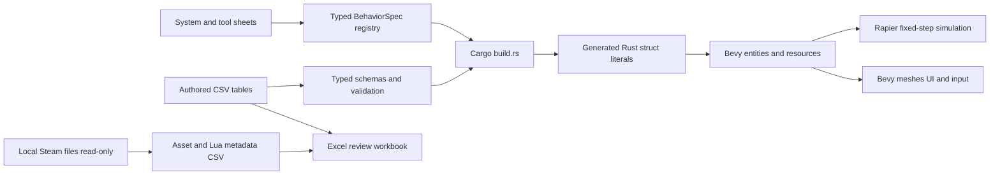

# Rust Workshop

Independent **Bevy 0.16.1 + Rapier 0.30** sandbox foundation, with spreadsheet-authored data and a Garry's Mod parity research catalog.

**This is not a complete Garry's Mod replacement, a Source port, or a Lua-compatible engine.** It is a working first implementation plus an explicit roadmap. No proprietary assets or Valve/Facepunch implementation code are bundled.

## Start

On this machine, double-click `play.cmd`, or from Windows cmd:

```bat
cd /d C:\Users\Drew\Projects\rust-sandbox
set "CARGO_TARGET_DIR=D:\jcode-build\rust-sandbox-20260929"
cargo run -p rust-sandbox
```

The launcher builds first, so spreadsheet edits cannot silently leave you running an old binary. First build requires Rust, MSVC build tools, dependency downloads, and a supported graphics adapter. The selected versions are a deliberately verified compatible pair, not a claim to be the latest Bevy release.

## Delivered files

| Location | Purpose |
|---|---|
| `sheets/props.csv` | Authored procedural prop sizes, mass, friction, bounce, color |
| `sheets/world.csv` | Gravity, physics tick rate, floor size, movement, distances, prop limit |
| `sheets/scene.csv` | Initial prop instances and frozen state |
| `sheets/systems.csv` | 64 major system specifications and parity gaps |
| `sheets/tools.csv` | 37 installed stock tool specifications, including internal/example entries |
| `sheets/sources.csv` | Research citations and evidence limitations |
| `sheets/milestones.csv` | Sequenced implementation plan and acceptance gates |
| `local/inventory-20260929/` | Installed file and VPK metadata, Lua declaration candidates, stock tool list |
| `local/gmod-research.xlsx` | Generated Excel review workbook, when exported |
| `local/content_generated.rs` | Inspectable generated Rust example, when generated |
| `docs/PLAN.md` | Architecture, parity definition, phases and risks |
| `docs/SCHEMA.md` | Spreadsheet contract and units |
| `docs/RESEARCH.md` | Sources, decisions, observed installation scope |
| `docs/VALIDATION.md` | Executed checks and untested boundaries |

CSV sheets are the **authoritative editable source**. Open them in Excel or LibreOffice and save as UTF-8 CSV. XLSX is an exported review snapshot, not a second source of truth. To use edits made in the workbook, export the relevant tab back to its named CSV before rebuilding. No Excel formulas are evaluated by the build.

## Implemented gameplay

- Lit 3D workshop with four original procedural prop types and a spreadsheet-built spawn menu.
- Fixed-step rigid-body gravity and collisions, mass, friction, restitution and CCD.
- Free-fly camera, ray-targeted grabbing, distance adjustment, simple rotation, freeze/unfreeze.
- Single-prop duplication/removal, 32-step scene-snapshot undo, reset.
- Versioned JSON save/load with validation before live-world replacement. Saves get new filenames.

Controls are displayed in the game. **Middle mouse** looks around. **WASD / Space / Left Shift** flies. Click a menu entry or press **Enter** to spawn. **Tab / 1-4** selects a prop. **Left mouse** holds a targeted prop, **wheel** adjusts distance, **E** rotates, **right mouse / F** freezes, **R** unfreezes, **X** removes, **C** duplicates, **Z** undoes, **F9** resets, **F5** saves, **F6** loads the latest save, **Esc** exits.

## Spreadsheet to Rust



Descriptions become typed **specification metadata**, not magic executable behavior. Systems still need implementation and tests. The prototype runtime consumes prop/world/scene data. The compiled behavior registry records what remains.

```bat
cargo run -p sandbox-catalog -- validate sheets
cargo run -p sandbox-catalog -- generate sheets local\content_generated-new.rs
cargo run -p sandbox-catalog -- inventory "D:\SteamLibrary\steamapps\common\GarrysMod" "C:\Users\Drew\Projects\rust-sandbox\local\inventory-new"
cargo run -p sandbox-catalog --features workbook -- workbook sheets local\inventory-20260929 local\gmod-research-new.xlsx
cargo test --workspace --all-features
cargo run -p rust-sandbox -- --headless-smoke
cargo run -p rust-sandbox -- --smoke
```

The inventory and export commands refuse existing destinations. Inventory reads directory metadata, not an entire asset payload into spreadsheet cells. Paths, sizes, archive location, declared CRC and provenance are cataloged. **CRC is recorded, not independently verified.** Binary models/textures are not converted into Rust or redistributed.

## Important gaps

No Source maps/models/materials importer, walking player, ragdolls, constraint tools, multiplayer, NPCs, vehicles, audio, Lua runtime, Workshop integration, or GMod save/addon compatibility yet. Rapier is not Source VPhysics. The reference game has not been run through a comparative parity harness. The 101 research rows are a structured initial baseline, not proof that every engine behavior or community addon has been enumerated.
