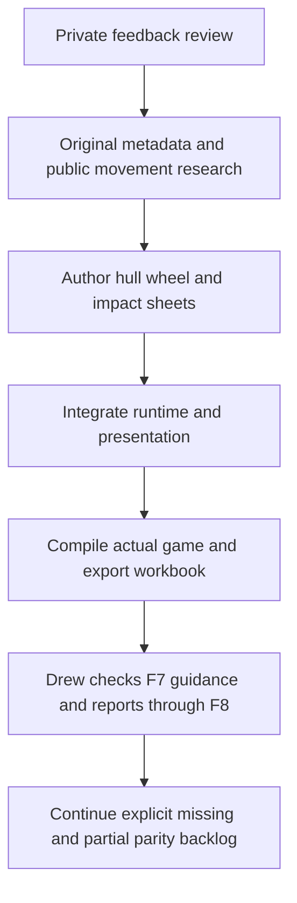

# Feedback usability and visual-note review

## Latest motion and impact feedback, 2026-09-30

Four additional local reports were reviewed after the single-note release. The priority sheet now has 15 rows. The new [19 manual cases](../sheets/motion_impact_cases.csv) and four F7 cards cover crouch, bullet impacts, vehicle wheel/crash presentation and live HUD readouts. Every acceptance result remains `not_run`, owned by Drew. Private report text and filenames are not published.

1. Movement: use Ctrl for a shorter capsule, slower speed and eye transition. Ground duck preserves feet. Air duck preserves the top and raises feet. Expansion checks the full standing hull. Original physgun/pistol crouch idle and eight directional walk clips are authored. Vehicle entry and respawn restore canonical standing geometry. Native box-hull collision, exact simultaneous jump/duck ordering, crouch boost and specialized duck-jump interpolation remain open.
2. Impacts: reuse actual ray-hit normals and mounted original concrete impact texture. Bounded child quads follow struck props, expire and clean up with parents. Short bursts are shared with explosions and vehicle contact events. Material tools explicitly exclude mark meshes. This is not material-specific projected Source decal or particle parity. Quad clipping, blood/dust/audio, BSP overlays and persistence remain open.
3. Vehicles: reuse the existing original-model skeleton and CPU skinning, with 12 authored attachment/radius/front-steer records across Jeep, Jalopy and APC. Signed forward speed drives roll. Visible-distance culling bounds skinning scope. Replacing static parts preserves saved color/material without changing physics. Actual Rapier contact-force events trigger cooldown-limited bursts. Native suspension pose parameters, speed-dependent steering, engine/crash audio, deformation and crash damage remain open. Airboat and passive seats receive no invented wheels.
4. HUD: measured real-frame FPS and milliseconds remain visible during pause, with gameplay health and clip/reserve panels in lower corners. Existing layout sheets own spacing and gameplay tuning owns the refresh interval. Native fonts, armor, weapon selection, notifications and exact stock layout remain open.
5. Delivery: compile the real executable, validate the production sheet loader, regenerate 134 coverage rows and export a new workbook. Do not run tests or automate gameplay. This slice does not complete all 169 root parity gaps, remaining NPCs, weapons, tools, menus or native vehicle simulation.

## Scope and priorities

All four saved reports were reviewed locally. Their contents and filenames remain private. The engineering priorities and acceptance boundaries are authored in [feedback_review_plan.csv](../sheets/feedback_review_plan.csv). The 20 [manual cases](../sheets/feedback_editor_cases.csv) are Drew-owned and remain `not_run`.

1. Replace the four-field feedback form with one note. Preserve existing draft text, original captured context, local-only reports and explicit retargeting.
2. Embed a real Windows multiline editable surface in the same game window. Reuse OS editing and Text Services Framework rather than building a recognizer or launching an editor. Respect the user's existing speech hotkey.
3. Correct weapon animation names from original mounted metadata, author draw clips and avoid silent bind-pose success. Keep unsupported activity sequences explicit.
4. Restore useful category grouping and mounted original icons to creation cards, including meaningful hover context.
5. Keep earlier water and NoCollide fixes available for user comparison. Do not treat old reports as resolved without acceptance or claim a new water renderer was implemented here.

## Feedback workflow

Press F8 over the relevant UI or tool, click the single note field, then type or use the existing Windows dictation shortcut (normally Win+H). Save note locally. F8/Escape returns to the prior screen. No separate title, text tabs, external editor, microphone capture, speech SDK, agent process or automatic report upload is introduced.

Windows requires an actual focused editable control. On Windows the panel hosts `RICHEDIT50W` from system `msftedit.dll`, plain-text mode and explicit `SES_USECTF` text-services support. The DLL is loaded from System32 only. HWND operations stay on the main thread through a Bevy NonSend resource. Position follows the physical-pixel UI rectangle after layout. Only F8/Escape/F10 are forwarded to game navigation. Normal text, clipboard, selection, undo, IME and dictation stay with the control. Text changes are mirrored before save/navigation actions and persisted through the existing draft path. Focus is requested only on open or an explicit click, not stolen continuously from Windows speech UI.

Windows still owns its listening indicator, permissions, network speech processing and privacy settings. This is not a guarantee of invisible or offline dictation. End-to-end Win+H, GPU/child-window composition, DPI and focus behavior require Drew's checks. If control initialization fails, basic single-field keyboard editing remains with an explicit limitation. Other platforms keep basic typing only.

Version-3 reports add `body`, derive `title` from the first nonempty line, and retain compatibility fields and captured context. Four-field drafts migrate to a labeled combined note without deleting the original legacy draft or existing reports.

## Researched presentation changes

Ten original mounted weapon models were inspected as metadata only, supplying eleven enabled combat routes (flechette shares SMG). `source_weapons.csv` owns idle/fire/reload/draw names. Notable corrections: SMG `@fire01`, AR2 `@IR_idle/@IR_fire/@IR_reload/@IR_draw`, RPG `@idle1`, shotgun `@fire01` rather than its one-frame `@fire`. Draw gates primary firing until its clip ends; reload sampling follows the authored gameplay interval. Missing required clips reject the new visual route instead of silently reporting success in a bind pose.

This is not complete native animation sequencing. Shotgun shell-by-shell phases/pump, grenade activity variants, secondary attacks, sound events, camera motion, sway and detailed IK remain open. Metadata discovery is not animation-decoding or visual acceptance.

Creation cards reuse original `materials/<icon reference>` images, then existing model spawnicons where available. Absent images are labeled. Categories show counts and headings, entries sort within categories, and image/caption activation share a route. Original content is read-only and not redistributed. Pixel-perfect Derma layout and addon coverage remain open.

## Delivery rules

Compile the actual game and run the production catalog validator/exporter. Export a new complete workbook without replacing previous snapshots. Do not run tests, input automation, screenshots or dictation on Drew's behalf. Update the F7 cards with practical checks and honest limitations. Record actual build/export outcomes in VALIDATION.md, then commit and publish reviewed paths only.
