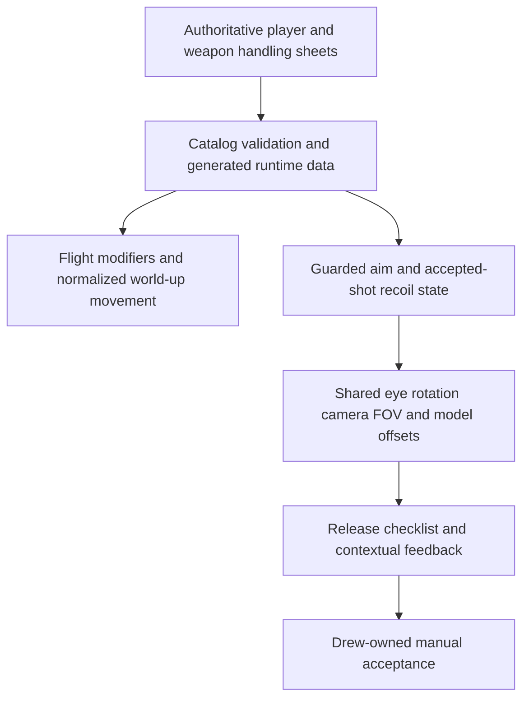
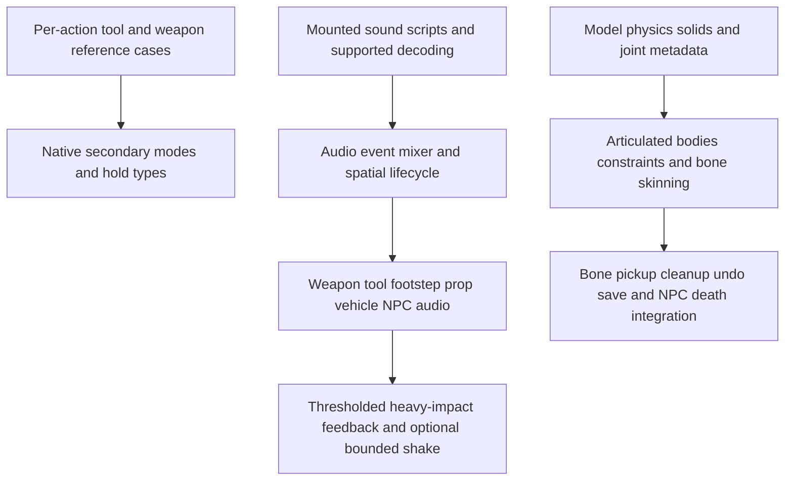
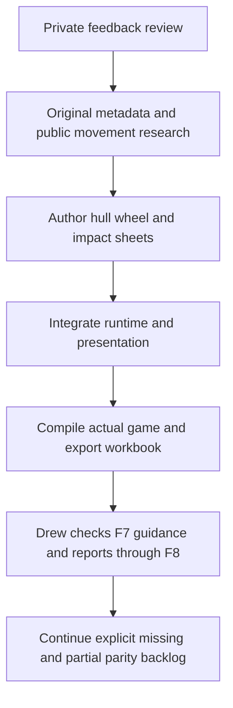

# Feedback usability and visual-note review

## Complete inbox review and handling integration, 2026-09-30 03:25 UTC

Reviewed all 18 local reports, including the four legacy multi-field reports and three new flight/recoil/aiming reports. [feedback_review.csv](../sheets/feedback_review.csv) maps all 18 to implementation boundaries and next actions without publishing private report text or filenames. None is gameplay-accepted. Earlier sections below are historical snapshots, not current completion claims.

### Ordered integration plan

1. **Flight input (P0):** fix the noclip branch ignoring sprint. Author boost and precision multipliers in `source_player.csv`, recognize both Shift and Alt keys, retain Space/Ctrl as world-up/down rather than rotating vertical input by camera pitch, and normalize the combined direction. Retain immediate stop rather than introducing unrequested inertial drifting. Guard typing, focus loss, death and vehicle occupancy. This is prototype handling, not measured GMod flight equivalence.
2. **Weapon data contract (P0):** add `source_weapon_handling.csv` with exactly one handling row for each of the eight enabled hitscan/projectile guns. Validate IDs, coverage, finite ranges, FOV, sensitivity, transition times, offsets, punch caps and recovery before generating game data. Tools, melee, thrown grenades and disabled registrations must not silently inherit gun ADS.
3. **Right-click aiming (P0):** custom hold-RMB aiming adjusts world FOV, sensitivity and shared weapon/hands offsets. Temporarily present first person when aiming from F4, restoring the requested third-person mode on release. Keep original fire/reload clips. Aim exits on reload, menus, focus loss, death, vehicles, switching and scene restoration. Require release after blocked UI input. Exact iron-sight offsets are initial authored tuning requiring Drew's visual calibration. Native SMG grenades, AR2 balls and shotgun secondary actions remain separate missing work, not silently marked implemented.
4. **Recoil (P0):** apply per-weapon camera punch and model kick only after an actual accepted shot, once per shot rather than per pellet. Bound accumulation and decay using frame-time exponential recovery. Use the same punched eye rotation for camera and subsequent firing rays, without permanently changing user look angles. Keep world-body pose/IK limitations explicit. Reset presentation transients at switch/menu/death/vehicle/restore boundaries. Reload cancels aim but lets the last shot's punch decay naturally, including one-round weapons.
5. **Integration safety:** inspect current-camera freshness and projection ownership so old-frame aiming or the base-FOV writer cannot undo the new behavior. Include aim/punch/flight tuning in F8 capture. Preserve all saves and private notes. Do not stop active games or launch duplicate copies during delivery.
6. **Delivery:** update authoritative review/follow-up/root-gap rows, F7 instructions and Drew-owned manual cases. Compile the real executable once after the integrated edits, fix any compiler errors, run production catalog validation/export, review diffs and publish only reviewed paths. No agent gameplay tests, screenshots, benchmarks or input automation under project rules.

### Remaining dependency queue

Keep the older 169-root-gap inventory and dependency queue intact. Next work is (a) native per-weapon secondary/hold-type contracts and exact model sight calibration, (b) mounted audio decoding/sound-script events and lifecycle, (c) material-pair prop contact sounds and bounded optional shake, (d) original physics-solid/joint metadata and articulated ragdoll entity lifecycle, then dependent posing tools and NPC death integration. In parallel with those dependencies, the already-partial water, browser, No Collide, crouch and vehicle repairs still require Drew's checks. All 38 tool rows remain 13 partial, 22 missing and 3 reference-only. No general request to complete everything is counted as resolved by planning alone.

## Regression follow-up, 2026-09-30 02:50 UTC

Seven newer reports were reviewed locally. [feedback_followup.csv](../sheets/feedback_followup.csv) tracks every topic in ten engineering rows, separating five repaired subsets from broader unfinished work. F7 now has 20 cards, including a repair summary, E + mouse instructions and explicit remaining scope. Original private reports are preserved unchanged.

### Implemented repair slice

- Wheel axes: the prior code inverted the wrong basis. The actual shared converter is Source `(x,y,z)` to Bevy `(-y,z,-x)`. Axles now use its inverse `(-z,-x,y)` before skeletal rotation.
- Crouch speed: at 60 Hz the prior standing stop floor removed `1.905 * 8 / 60 = 0.254 m/s`, while crouch acceleration restored only `10 * 1.143 / 60 = 0.1905 m/s`. That repeatedly erased progress below the floor. While actively crouch-moving the floor is capped at wish speed; releasing input still uses full stop braking. Authored crouch speed remains 30 percent of walking speed. This is an independent controller correction, not a native friction equivalence claim.
- Prop rotation: hold LMB, hold E and move the mouse to rotate about the grab point while camera look is suppressed. No input means no timed rotation. Shift snapping, roll modifiers and a collision-constrained angular solver remain open.
- World weapons: use the animated player's globals for matching weapon bone names and propagate unmatched children, then skin the held model. Reuse the same bone-merge principle already used by viewmodel hands. Attachment fallback remains for models with no shared bones. Per-weapon hold types and aim-pitch/IK layers remain incomplete.
- Spread: replace the single-pellet rim pattern with centered two-uniform-sum sampling, rejecting points outside the unit disc. The local deterministic stream is not native command-seeded RNG. Authored cone values remain unchanged; recoil and accuracy timers remain open.

### Remaining work, not implemented by this repair

Tool audit covers all 38 authored rows: 12 stock partial routes plus custom Freeze, 22 missing tools, and 3 reference-only entries. Existing `source_tools.csv`, option sheets and `tool_cases.csv` remain authoritative, and their advertised behavior is not accepted merely by reading dispatch code. Finish constraints/force limits and entity lifecycle prerequisites before dependent actuator/construction tools, then posing tools after articulated physics/flex support. Every left/right/reload/settings/save path needs Drew-owned acceptance.

Audio requires an enabled backend, supported decoding, mounted sound-script resolution, event timing, attenuation, loop stop/replacement, voice limits and controls. General prop-impact audio and camera shake are not provided by the existing vehicle spark effect. Do not fake every impact with a global earthquake. Native scope/secondary behavior must be specified per weapon; universal ADS is a separate custom feature, not automatically stock fidelity. Ragdolls require actual articulated body/constraint metadata, per-bone pickup and lifecycle/persistence, not a single rigid prop with a character mesh. These requests remain explicitly missing in the follow-up sheet.

## Latest motion and impact feedback, 2026-09-30

Four additional local reports were reviewed after the single-note release. The priority sheet now has 15 rows. The new [19 manual cases](../sheets/motion_impact_cases.csv) and four F7 cards cover crouch, bullet impacts, vehicle wheel/crash presentation and live HUD readouts. Every acceptance result remains `not_run`, owned by Drew. Private report text and filenames are not published.

1. Movement: use Ctrl for a shorter capsule, slower speed and eye transition. Ground duck preserves feet. Air duck preserves the top and raises feet. Expansion checks the full standing hull. Original physgun/pistol crouch idle and eight directional walk clips are authored. Vehicle entry and respawn restore canonical standing geometry. Native box-hull collision, exact simultaneous jump/duck ordering, crouch boost and specialized duck-jump interpolation remain open.
2. Impacts: reuse actual ray-hit normals and mounted original concrete impact texture. Bounded child quads follow struck props, expire and clean up with parents. Short bursts are shared with explosions and vehicle contact events. Material tools explicitly exclude mark meshes. This is not material-specific projected Source decal or particle parity. Quad clipping, blood/dust/audio, BSP overlays and persistence remain open.
3. Vehicles: reuse the existing original-model skeleton and CPU skinning, with 12 authored attachment/radius/front-steer records across Jeep, Jalopy and APC. Signed forward speed drives roll. Visible-distance culling bounds skinning scope. Replacing static parts preserves saved color/material without changing physics. Actual Rapier contact-force events trigger cooldown-limited bursts. Native suspension pose parameters, speed-dependent steering, engine/crash audio, deformation and crash damage remain open. Airboat and passive seats receive no invented wheels.
4. HUD: measured real-frame FPS and milliseconds remain visible during pause, with gameplay health and clip/reserve panels in lower corners. Existing layout sheets own spacing and gameplay tuning owns the refresh interval. Native fonts, armor, weapon selection, notifications and exact stock layout remain open.
5. Delivery: compile the real executable, validate the production sheet loader, regenerate 134 coverage rows and export a new workbook. Do not run tests or automate gameplay. This slice does not complete all 169 root parity gaps, remaining NPCs, weapons, tools, menus or native vehicle simulation.

## Scope and priorities

All four saved reports were reviewed locally. Their contents and filenames remain private. The engineering priorities and acceptance boundaries are authored in [feedback_review_plan.csv](../sheets/feedback_review_plan.csv). The 20 [manual cases](../sheets/feedback_editor_cases.csv) are Drew-owned and remain `not_run`.

1. Replace the four-field feedback form with one note. Preserve existing draft text, original captured context, local-only reports and explicit retargeting.
2. Embed a real Windows multiline editable surface in the same game window. Reuse OS editing and Text Services Framework rather than building a recognizer or launching an editor. Respect the user's existing speech hotkey.
3. Correct weapon animation names from original mounted metadata, author draw clips and avoid silent bind-pose success. Keep unsupported activity sequences explicit.
4. Restore useful category grouping and mounted original icons to creation cards, including meaningful hover context.
5. Keep earlier water and NoCollide fixes available for user comparison. Do not treat old reports as resolved without acceptance or claim a new water renderer was implemented here.

## Feedback workflow

Press F8 over the relevant UI or tool, click the single note field, then type or use the existing Windows dictation shortcut (normally Win+H). Save note locally. F8/Escape returns to the prior screen. No separate title, text tabs, external editor, microphone capture, speech SDK, agent process or automatic report upload is introduced.

Windows requires an actual focused editable control. On Windows the panel hosts `RICHEDIT50W` from system `msftedit.dll`, plain-text mode and explicit `SES_USECTF` text-services support. The DLL is loaded from System32 only. HWND operations stay on the main thread through a Bevy NonSend resource. Position follows the physical-pixel UI rectangle after layout. Only F8/Escape/F10 are forwarded to game navigation. Normal text, clipboard, selection, undo, IME and dictation stay with the control. Text changes are mirrored before save/navigation actions and persisted through the existing draft path. Focus is requested only on open or an explicit click, not stolen continuously from Windows speech UI.

Windows still owns its listening indicator, permissions, network speech processing and privacy settings. This is not a guarantee of invisible or offline dictation. End-to-end Win+H, GPU/child-window composition, DPI and focus behavior require Drew's checks. If control initialization fails, basic single-field keyboard editing remains with an explicit limitation. Other platforms keep basic typing only.

Version-3 reports add `body`, derive `title` from the first nonempty line, and retain compatibility fields and captured context. Four-field drafts migrate to a labeled combined note without deleting the original legacy draft or existing reports.

## Researched presentation changes

Ten original mounted weapon models were inspected as metadata only, supplying eleven enabled combat routes (flechette shares SMG). `source_weapons.csv` owns idle/fire/reload/draw names. Notable corrections: SMG `@fire01`, AR2 `@IR_idle/@IR_fire/@IR_reload/@IR_draw`, RPG `@idle1`, shotgun `@fire01` rather than its one-frame `@fire`. Draw gates primary firing until its clip ends; reload sampling follows the authored gameplay interval. Missing required clips reject the new visual route instead of silently reporting success in a bind pose.

This is not complete native animation sequencing. Shotgun shell-by-shell phases/pump, grenade activity variants, secondary attacks, sound events, camera motion, sway and detailed IK remain open. Metadata discovery is not animation-decoding or visual acceptance.

Creation cards reuse original `materials/<icon reference>` images, then existing model spawnicons where available. Absent images are labeled. Categories show counts and headings, entries sort within categories, and image/caption activation share a route. Original content is read-only and not redistributed. Pixel-perfect Derma layout and addon coverage remain open.

## Delivery rules

Compile the actual game and run the production catalog validator/exporter. Export a new complete workbook without replacing previous snapshots. Do not run tests, input automation, screenshots or dictation on Drew's behalf. Update the F7 cards with practical checks and honest limitations. Record actual build/export outcomes in VALIDATION.md, then commit and publish reviewed paths only.
