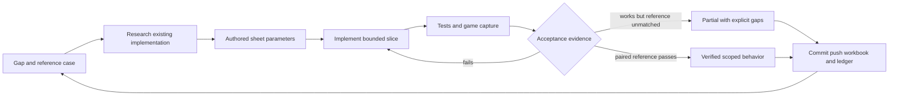

# Systematic stock-GMod parity implementation plan

Baseline: commit `9daef2f`, stock Sandbox against installed app 4000 build 25375506. The 169-row `sheets/parity_gaps.csv` is the starting discovery inventory. It is not proof that every native API, option or addon is specified. Keep broad discovery rows open while expanding them into smaller cases.

## Operating rules

1. Work on one bounded feature slice at a time in this terminal. Do not start autonomous recurring jobs or workers.
2. Before editing, inspect Git status and relevant diffs. Preserve saves, original Steam files, credentials and unrelated changes.
3. For each slice: research existing code/content, author parameters in sheets, implement, run focused tests, exercise the actual game workflow, inspect captures and record limitations.
4. Track implementation separately from reference parity. `partial` can improve without becoming `verified`. A matching-looking screenshot without a pinned original comparison is not verified parity.
5. Commit coherent milestones, push to the existing public repository, and verify the remote commit. Refresh the public workbook whenever its CSV inputs change. Never upload proprietary payloads or private captures.
6. A running game does not hot-reload Rust code. Build the new executable separately if a running instance locks it. Restart only the game instance used for testing, not other sessions or the user's unsaved game.
7. Record real blockers and unfinished boundaries. Do not claim that this multi-system project is complete after one feature batch.

## Ordered work packages

| Order | Scope | Dependencies | Concrete exit gate |
|---|---|---|---|
| 00 | Reference and inventory discipline | Existing catalogs | Each claimed fix has a reproducible case; expand widget/convar/weapon/entity registries; retain unresolved discovery work |
| 01 | Physgun presentation | Original weapon attachments and mounted textures | Attached core/prong glow, visible textured beam, clean release/switch/removal; first/third-person checks; no parity claim without original captures |
| 02 | Physgun interactions and input safety | 01 plus collision queries | Actual hit-point grab, occlusion, freeze/reload/rotation semantics, focus/menu isolation and lifecycle tests |
| 03 | Authentic stock Q/C menus and HUD | Reference screenshots and installed spawnlists | Stock layout and typography, real scrollable tree/grid, focused search, tool sidebar, context actions, input and multi-resolution comparison |
| 04 | Player animation and movement | Hull/content reference fixtures | Directional/crouch/airborne animations, blends and IK; crouch/steps/slopes/water/ladders; measured movement traces |
| 05 | Content/rendering fidelity | Asset-format and shader corpus | PHY collision, model variants/LODs, materials/proxies, lighting, water, sky, decals and unsupported-asset reports |
| 06 | Tool framework and entity semantics | 02 plus stable commands/ownership | Staged click/reload/cancel, ghost previews, convar panels, permissions, grouped undo and cleanup |
| 07 | Constraints and construction tools | 05/06 | Every stock joint and actuator has anchor/break/undo/save/duplication cases; then complete each remaining tool |
| 08 | Persistence and ragdolls/posing | 04/05/07 | Transactional scene/assembly restore, per-bone physics, posing, modifier preservation and negative-input corpus |
| 09 | Audio, weapons and damage | Entity events and player lifecycle | Per-weapon/action timings, ammo, projectiles, damage types, spatial loops and soundscapes |
| 10 | Map I/O, NPCs, navigation and vehicles | 05/06/09 | Every scoped map entity class accounted for; NPC and vehicle behavior suites |
| 11 | Server and network | Stable authority, identities and measured semantics | Two-client replication, late join, ownership, prediction/reconciliation and latency/loss cases |
| 12 | Lua/Derma/gamemode compatibility | Stable entity/render/network interfaces | Explicit versioned API corpus, realm/hook/timer/storage/net semantics and security boundaries; stock gamemode suites |
| 13 | Steam, Workshop and addon scope | 11/12 and archive/mount safety | Authorized lifecycle integration, precedence and dependency handling, per-addon compatibility records |
| 14 | Performance and release gates | Runs throughout all packages | Repeated load/frame-time/memory/physics measurements, malformed-input checks, clean-checkout build and known deviations |

Packages are ordered by dependency, not a promise that everything fits in one session. Security and performance checks apply throughout. The per-tool inventory includes all 37 installed entries, with internal/example/legacy cases explicitly distinguished.

## Current batch: 01A, physgun glow and beam

- [x] Inspect current beam path: a debug line/sphere, no glow sprites.
- [x] Locate installed physgun glow/beam textures and authored muzzle/fork attachments.
- [ ] Validate effect parameters in an authored sheet and compile them into runtime data.
- [ ] Add additive camera-facing attachment sprites in the correct view/world render layer.
- [ ] Replace the debug line with a textured scrolling beam and endpoint effect.
- [ ] Ensure effect resources are reused, finite and hidden on tool switch, disabled viewmodel and deleted/released target.
- [ ] Test attachment placement, beam degenerate cases and effect lifecycle.
- [ ] Run actual idle/held first-person and third-person captures, switch to toolgun and inspect cleanup.
- [ ] Update research, validation, gap statuses and public workbook, then commit/push/verify.

Remaining 01 work stays open: reference-matched pulse/intensity/beam shape, claw sequences, correct hit-point endpoint, player color, audiovisual events and evidence for any actual projected illumination. Do not substitute arbitrary point lights for the reference behavior.

## Next batch: 03A menu shell, after 01A acceptance

Capture matched stock Q menu states first. Inventory panel sizes, fonts, padding, splitters, tabs, spawnlist hierarchy, icon states and right-side tool controls. Replace the custom three-tab arrangement with a stock-shaped shell, without claiming unimplemented tool buttons work. Add focused text input and scrolling before favorites/custom spawnlists. Capture at two resolutions and test Q/C/Escape/focus behavior before proceeding to tool controls.

## Backlog expansion checklist

For every stock tool: primary/secondary/reload, target eligibility, stages/cancel, each panel option and default/range, key bindings, effects/sounds, permissions/limits, undo, cleanup, duplication, persistence and multiplayer. For every UI widget: layout, text, hover/pressed/disabled, focus/tab order, scrolling, resize and localization. For every weapon/entity: spawn, initialization, update, interactions, damage, removal, invalid targets and save/network behavior. Native registrations and dynamic Lua registrations require reference enumeration; lexical catalogs alone cannot close those gaps.
