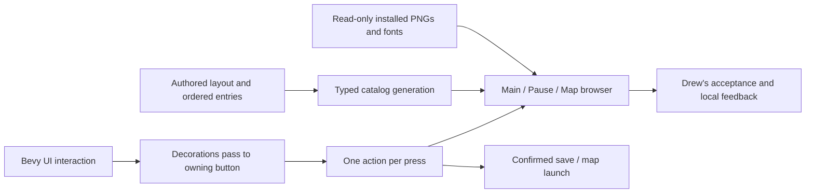

# Reference-driven menu repair, 2026-09-29

Drew reports the previous menu does not work and requests exact placement rather than another approximate sidebar. Gameplay testing remains exclusively Drew's responsibility.

## Diagnosed failure

Every Bevy Node requires FocusPolicy. Its default is Block. The previous frontend put a Text child over each Button without setting Pass. Bevy 0.16.1 ui_focus_system stops at that child even though it has no Interaction. Thus clicks on labels do not reach buttons. The same pattern exists in the Q menu and image thumbnails. This is a source-level diagnosis, not an automated reproduced test.

## Execution order

1. Record stock main.html ordering and visibility, PageOptions responsive geometry, NavBar footer, NewGame map/cards/settings geometry and controller behavior. Author dimensions in source_frontend.csv, ordered main entries in source_main_menu.csv, and detailed evidence/remaining work in menu_reference.csv.
2. Replace text-blocked button input with explicit pass-through decorative nodes and one changed-Interaction action per physical press. Preserve pause and click-through guards. Apply equivalent hit-target fix to the Q browser.
3. Read existing installed background, logo, footer icons and map thumbnails without copying them into the repository. Read Windows Arial fonts as the original CSS fallback, with existing engine defaults if unavailable. Keep independent application identification visible.
4. Replace the sidebar with the original upper-left text menu, conditional Resume/Disconnect and separator rows, hover styling and 50px footer. Handle responsive breakpoints from the reference. Feedback stays a separate extension and does not shift native rows.
5. Build the original white map-browser region, category/search column, 128px thumbnails, independent favorite controls, selection, double-click launch, right-side settings region and anchored Start Game. Persist supported map selection and favorites locally. Keep unsupported settings visibly honest.
6. Expose every original main-menu route. Preserve functional local saves/options. Do not pretend that browser shells implement missing Workshop/network/native backends. Inventory each remaining screen/control for subsequent work.
7. Build actual executable when the existing game is closed, export a new full workbook snapshot and commit reviewed paths. Launch normally without automated inputs or screenshots. Record compilation and normal startup separately from Drew's acceptance.

## Expanded execution plan after the 19:28 request

`menu_work_items.csv` is the ordered 40-package screen-by-screen backlog. The detailed source inventory now consists of 368 HTML control/label definitions, 1138 CSS layout/style declarations, 140 native option controls and 30 Sandbox new-game options. Each inventory row has a source reference and remains `not_run`. These sheets are exported into the same full catalog workbook as gameplay data, not a disconnected planning document.

1. **Input and navigation:** finish label/image hit repairs, normal startup/pause routing, map selection/search/favorites, responsive footer labels, intrinsic icon sizes, and page-preserving anchored popups. Compile the actual source-map binary and launch normally for Drew.
2. **Layout fidelity:** work through each CSS declaration at its source line, resolving media queries, inherited fonts, exact text metrics, gradients, shadows and scrollbars. Compare 1920x1080, 1280x800, 940x600, 800x600 and 640x420 plus either side of each breakpoint. Only Drew performs interactive or visual acceptance.
3. **Native local workflows:** replace the generic Options panel with measured native tabs and real supported controls, including startup persistence, Apply/Cancel/reset and key binding conflicts. Implement each of the 30 Sandbox settings only when its actual runtime effect exists. Finish local save-browser selection, loading recovery, confirmations, and full Q-menu tool widgets.
4. **Backend-dependent screens:** implement the real server browser/network startup, compatible addon lifecycle, dupe/demo browsers, mounted-game status, translations, mode runtime, full C menu and HUD. Do not replace missing behavior with a convincing but fake working control. The present notices and single supported choices are explicit partial implementations.
5. **Acceptance:** retain an open result for every untested state. Compile success and a visible process do not establish working buttons or one-to-one placement. Refresh the workbook after each coherent implementation pass and commit reviewed paths without touching Steam content or saves.

The current popup pass adds outside-click and Escape dismissal without changing the current page. The map pass resets double-click history after unrelated actions, sorts map IDs, hides empty filtered categories and autofocuses map search. Footer artwork now uses mounted PNG dimensions (32px Back icons, 16px Games/Problems stars, 24px mode icon), not a uniform stretched size. Full popup contents and backend parity remain open.

## Honest boundaries

The stock main/new-game HTML is available, but OpenOptionsDialog is native engine UI, not a fully specified HTML options page. Complete networking, Workshop addons, demo playback, native saves and mode compatibility remain separate unfinished work. Exact Chromium letter spacing/line metrics, background rotation, native shadows, blur and gradients need reference comparison. No build-only claim of complete one-to-one equivalence is permitted.
