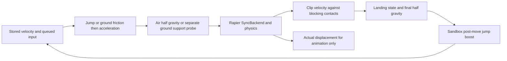

# Running drift investigation and repair

Request: 2026-09-29 20:17 UTC. Drew reports that running feels like drifting after the preceding momentum change. This is a real user-reported regression. Source inspection identifies concrete implementation mistakes, but does not itself establish that the revised game feels correct.

## Evidence and corrections

| Finding | Reference | Change |
|---|---|---|
| Friction 4 was a generic SDK default, not the installed GMod preset | R14 utilities_menu.lua:21-40 gives friction 8 | source_player.csv now authors 8, not an arbitrary tuning value |
| Low speed has an explicit stop threshold | R12 WalkMove:1965-1972 zeroes speed below 1 HU/s | minimum_move_speed = 0.01905 m/s |
| Grounded walking has zero gravitational vertical velocity | R12 FullWalkMove clears vertical before ground friction/walk and after finishing gravity | Ground support query is separate from velocity, with gravity only in air |
| Total travel is not final momentum | R12 WalkMove/TryPlayerMove/ClipVelocity and R15 KCC output | Stored velocity survives freely moving ticks; blocking normals clip it after physics |
| Steps/snaps/nudges may move the hull without imparting velocity | R15 move_shape and handle_slopes | effective_translation/dt is used only for animation, never next-tick acceleration |
| Collision may happen partway through a tick | R12 TryPlayerMove | Clip final velocity, not average distance covered before hitting a wall |
| Landing and ceiling contacts must affect vertical velocity | R12 clipping and FullWalkMove | Resolve contacts before final gravity and zero grounded vertical velocity |
| Steps must not be taken while jumping | R12 WalkMove ground gate | Disable Rapier autostep and ground snap on airborne ticks |
| Jump boost belongs after movement | R13 Sandbox FinishMove | Compute bounded boost from collision-clipped velocity in the post-physics phase |
| Physics clocks must agree | source_play.rs and R15 scheduling | Existing 60Hz clocks already agree; no speculative tick-rate change |

The preset loader can replace the Lua fallback with native GetDefault values. No live GMod convar dump was taken. Preset evidence is stronger than the generic SDK assumption, but exact reference reproduction still requires the same engine build, convars, surface and tick interval.

## Ground algorithm and why 4 felt slippery

For planar speed `v`, stop speed `s`, friction `f`, surface multiplier 1 and timestep `dt`:

`v_after_friction = max(0, v - max(v, s) * f * dt)`

Acceleration then adds along normalized input direction `d`:

`add = min(max(0, wishspeed - dot(velocity, d)), acceleration * wishspeed * dt)`

Lateral momentum is reduced by friction rather than instantly deleted when turning. At 400 HU/s and this project's 1/60s tick, the first no-input decrement is 53.33 HU/s with friction 8, versus 26.67 with the previous 4. These are arithmetic consequences of the formula, not measured game results. Below 100 HU/s the constant stop-speed term brings motion to rest, followed by the 1 HU/s cutoff. Holding a movement key continues acceleration, and airborne velocity intentionally does not receive ground friction.

AirAccelerate still caps projected wish speed at 30 HU/s while using uncapped wish speed for the legacy acceleration term. Fresh jump presses avoid ground friction on successful takeoff. This is not auto-bhop or an instant-stop arcade controller.

## Revised tick flow

Ground adhesion currently uses Rapier's downward movement/snap adapter, not Valve's exact upward/downward hull trace. Stair-face contacts that did not block the requested travel are not treated as persistent walls. Walkable support normals are excluded from horizontal momentum clipping during grounded movement. The controller retains the KCC support result because successful steps/snaps may not emit floor collision events. A guessed ground state derived solely from sweep events would be unsafe.

## Regression and user acceptance

The existing headless controller harness now includes both production movement phases. Added `gmod_ground_stop_does_not_use_sdk_friction` covers authored friction 8, releasing a sprint, reaching zero velocity and no subsequent flat-floor creep. `contact_clipping_removes_only_inward_momentum` covers one wall, a corner and movement away from a wall. **These tests were added but not run or test-compiled**, respecting Drew's testing instruction. Their thresholds are proposed regression bounds, not reference-game measurements.

Manual rows in movement_reference.csv cover straight sprint/release, 90-degree turns, reversing, idle flat/slope stability, partial-tick wall impacts, corners, ramps, stairs, ceiling impacts, takeoff, landing and preserving air strafing. F8 feedback now includes command direction, sprint flag, persistent horizontal/vertical velocity and movement coefficients alongside the existing pose and actual local displacement velocity. This helps distinguish continuing input, low friction, contact classification and camera/animation issues in Drew's next report. Files remain local, with no telemetry or recurring agent job.

## Remaining limits

- Rapier capsule sweeps, broad grounded flags and step solving are not Source axis-aligned hull/quadrant traces. Full surf, acute-corner and step equivalence is not claimed.
- Surface-specific friction, ground/base velocity on moving platforms, crouch, water, ladders and native prediction/user-command timing remain incomplete.
- Input is currently sampled in the existing Update path, while movement uses fixed ticks. This retains the previous render-to-fixed timing boundary; no new input scheduling equivalence is claimed.
- Compiling proves type/integration compatibility, not stopping distance or game feel. Drew must accept the actual revised game, including repeated runs at different render rates.
