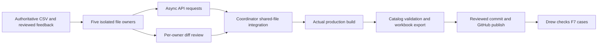

# Parallel continuation integration plan

## Requested outcome and boundaries

Continue the exhaustive `sheets/parity_gaps.csv` and dependency-ordered `sheets/work_queue.csv` backlog. Drew explicitly requested five Luna workers on 2026-09-30. This batch uses five bounded implementation domains rather than five competing rewrites of the game. Missing native systems remain visible and are not relabeled complete because a prototype compiles.

## Ownership and async protocol

| Owner | Exclusive implementation paths | Batch objective |
|---|---|---|
| Luna weapons | source_weapons.rs, source_weapon_gravity.rs, catalog/gravity.rs, source_gravity.csv, source_weapons.csv | Distinct gravity-gun punt/pull/hold/drop/launch with authored limits and lifecycle cleanup |
| Luna NPCs | source_npcs.rs, source_npc_equipment.rs, source_npc_equipment.csv, NPC cases | Bounded ranged bursts, magazines and reload pauses for explicitly supported actors |
| Luna vehicles | source_vehicles.rs, source_vehicle_visuals.rs, vehicle authoring tables | Ground-contact traction, braking and steering without midair drive forces |
| Luna menus | source_menu.rs, source_menu_favorites.rs, menu cases | Persistent favorites, filtered category counts and usable category navigation |
| Luna water/movement | source_player.rs, source_water.rs, catalog/player.rs, source_player.csv | Authored swimming and water-level movement while preserving ground/noclip controls |
| Coordinator | source_play.rs, source_scene.rs, catalog/spawn.rs/lib.rs/main.rs, build.rs, shared coverage/gaps/release/audio tables and shared docs | Review API requests, integrate schemas and lifecycle, consolidate production compilation and publish |

Each worker reads git status/diffs before editing, sends exact API requests by direct message and stops editing when ready for integration. No worker commits another worker's changes. The coordinator stages only reviewed paths. No concurrent Cargo builds or speculative blanket enablement of unsupported registrations. Workers do not launch the game or run tests. Private feedback, saves, installed assets and configured model choices are preserved.

## Integration gates

1. Review original installed or public source references before choosing behavior. Put sources and deviations in each domain plan and summarize in RESEARCH.md.
2. Validate all new numeric fields as finite and bounded. Ensure disabled registrations stay disabled and supported routes retain their identities.
3. Review equipment/input lifetime across menu entry, focus loss, death, vehicles, weapon changes, target removal and scene restore.
4. Preserve existing scene format compatibility. New transient equipment state must have an explicit restore policy; it must not accidentally become shared between different actors or mutate old saves.
5. Update `playable_coverage.csv` through the existing exporter, not an invented parallel ledger. Update gap states only to the implemented scope and leave all unperformed acceptance as `not_run`.
6. Add concise in-game F7 cards plus domain manual cases. Export one combined review workbook once the authoring tables settle.
7. Compile the real `source-map` game binary into the private D: target directory, inspect stderr, fix actual failures and recompile affected production code. Catalog validation/export are allowed. Tests, test compilation, Clippy, benchmarks, screenshots, input automation and gameplay validation remain Drew-owned under AGENTS.md.

## Explicit remaining scope

This batch does not claim completion of native Source physics, full vehicle scripts, all NPC registrations or schedules, articulated ragdolls, all weapons and secondary attacks, Derma/Lua compatibility, networking, Workshop/Steam integration, renderer/material parity or reference-matched menus. The 169 root-gap entries remain the complete current inventory; detailed per-registration rows and manual cases supplement them. Completion requires implementation evidence and Drew's gameplay acceptance, not just registration or a successful build.
