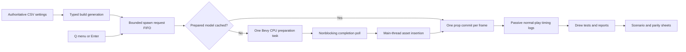

# Spawn responsiveness and parity continuation

Date: 2026-09-29. Trigger: Drew reports substantial lag, especially spawning props. Drew performs all testing. The agent builds and launches the normal game, without driving input or running test harnesses.

## Execution order

1. **Fix avoidable implementation costs first.** Optimize engine/physics/asset dependencies using Bevy's recommended development profile. Share immutable cached geometry and mounted source data. Do not reduce map detail, collision fidelity, CCD, prop limits or fixed simulation rate to disguise lag.
2. **Remove cold spawn preparation from the game update.** Queue interactive Q-menu/Enter requests in FIFO order. Capture requested position immediately. Prepare original model geometry, VMT/VTF textures, mipmaps and convex hull in one existing Bevy compute-pool task. Poll completion without waiting. Insert GPU assets and commit one entity request per update. Cached spawns skip preparation.
3. **Preserve operation safety.** Check queued plus live counts against the existing prop limit. Apply the queue bound from `source_performance.csv`. Z cancels the latest pending spawn before undoing a committed scene operation. Scene restoration clears outstanding spawn requests. Failed loads report an error and do not create undo entries. Cancelled CPU preparation may finish but cannot spawn its cancelled request. No Steam content or saves are overwritten.
4. **Remove avoidable idle-frame work.** Resolve tool targets only when a relevant input needs one. Beam firing still traces its endpoint. Write HUD text, projection FOV and gravity only when changed, avoiding unnecessary downstream change processing.
5. **Expose normal-play evidence without automated testing.** Log CPU preparation and entity commit durations. Every authored report interval, log focused-window frame median, p95, maximum, over-budget count, prop count and queued requests. These include frame pacing and scheduling, not isolated GPU time. Startup and focus transitions can contaminate initial windows. The 16.667 ms target is proposed, not stock measurement.
6. **Build and hand off.** Export a fresh workbook including scenario-level acceptance, build the real source-map target, review/commit changed paths, then launch for Drew. Do not mark performance passed from compilation or startup.

## Spreadsheet authority and continuation

- `source_performance.csv`: executable queue bound and timing settings, compiled by build.rs and catalog generation.
- `performance_cases.csv`: cold/warm spawning, active physics, cancellation, idle work, timing, upload, menus, scaling/memory and original collision boundary. Results remain awaiting Drew or not measured.
- `parity_gaps.csv`: all 169 known gaps remain tracked. Performance promoted to P0, still unverified.
- `work_queue.csv`: the existing quality package temporarily prioritizes the lag report. Other packages are retained, not relabeled complete.
- After this handoff: use Drew's results to distinguish continued physics lag, upload stalls, UI icon load and animation costs. Then continue interaction_02, menu_03a and player_04, including stock spawnlists/skin and actual animation layers/IK. Original collision metadata and spawn placement remain content_05/physics_05b work, not solved by optimization.

## Explicit boundaries

GPU upload and pipeline creation still happen on rendering threads and can hitch. Menu icon decode remains synchronous. Model cache memory has no eviction policy. CPU skinning remains per-frame. Scene restore and startup still prepare missing assets synchronously. The duplicator normally reuses its source model cache but uses the existing direct spawn path. Exact hull-input deduplication does not implement original PHY solids or Source contact/inertia rules. The current fixed-distance prop placement is not stock surface-trace placement. No universal one-to-one or performance claim follows from these changes.
