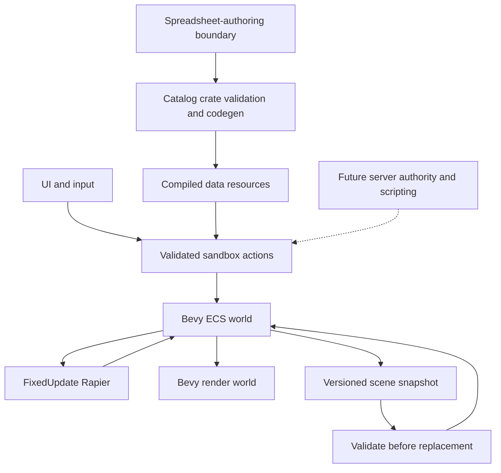

# Independent Bevy sandbox: parity plan

Active implementation order and current acceptance checklist: [IMPLEMENTATION_PLAN.md](IMPLEMENTATION_PLAN.md). The milestone table below is the original architecture roadmap, not a current completion report. Consult `sheets/parity_gaps.csv` and `docs/VALIDATION.md` for present evidence.

## 1. Define the target before calling it one-to-one

Reference installation: Steam app 4000, build **25375506**, inventoried 2026-09-29 UTC. The first target is the installed **stock Sandbox** experience. Base and Trouble in Terrorist Town files are also present and cataloged. Workshop and mounted games form a separately versioned compatibility surface. A complete inventory of every possible community addon is not a finite deliverable.

Parity has independent dimensions:

1. **Feature coverage:** each supported action, setting, entity type, tool and UI state is listed.
2. **Behavior:** the same controlled inputs produce equivalent externally observable state transitions.
3. **Physics:** trajectories, contact outcomes and constraints fit explicitly chosen tolerances, not bit equality assumed between different solvers.
4. **Visual/audio:** approved reference scenes, materials, animation, effects and sound behaviors have comparative review.
5. **Content:** supported formats, mount precedence and missing-content handling are compatible for a pinned local corpus.
6. **Scripting:** documented Lua APIs, realms, hooks and errors pass a stated conformance suite.
7. **Network:** authoritative simulation, prediction and replication behave correctly under latency and loss.

No row is certified as parity merely because its name appears in a spreadsheet or a Bevy struct exists. `prototype` means a limited independent implementation, often with different controls and behavior.

## 2. What a spreadsheet can and cannot do

It can define identifiers, dimensions, physical properties, materials, input maps, entity archetypes, state transitions, constraints, budgets and acceptance cases. A compiler can validate those rows and emit typed Rust data. It cannot recover unavailable native engine logic or automatically translate arbitrary Lua/C++ behavior from a prose description.

Current generator: `props.csv`, `world.csv`, `scene.csv` become `PropDef`, `WorldDef`, `Placement` literals. `systems.csv` and `tools.csv` become a `BehaviorSpec` registry. Their `rust_target` cells name current or planned implementations, not automatically created implementation classes. Future schemas should be added only when an actual system consumes them.

Binary art belongs in a content store, referenced by spreadsheet identifiers, with provenance and licenses. Encoding gigabytes of binaries into cells would make editing, diffing, import and validation worse without making the content executable.

## 3. Runtime architecture

Present: a small catalog crate has no Bevy dependency. The application uses Bevy ECS and rendering with Rapier. This is our own sandbox application/compatibility layer **on Bevy**, not a renderer or solver written from scratch. Actions are shared by UI, tests and smoke runs. Authoritative multiplayer will require stable application IDs rather than serializing Bevy entity indices.

Prototype units are meters, kilograms, seconds, +Y up. The Source importer now has tested coordinate and unit conversion. Exact Source movement, mass properties and physics behavior remain separate measurement and compatibility work.

## 4. Milestones and exit gates

| Stage | Work | Exit gate |
|---|---|---|
| M0 reference baseline | Pin game build, inventory files, enumerate stock tools, create citations and coverage ledger | Reproducible inventory and every stock tool accounted for, with internal examples distinguished |
| M1 data-driven foundation | Schemas, safe generated Rust, procedural props, fixed physics, viewport, editing, saves | Actual CSV -> compiled Rust -> Bevy ECS -> collision workflow passes and renders |
| M2 measurable reference | Build controlled test maps or permitted addons to record stock behavior, input sequence, state and timing | Paired recordings for spawn, grab, freeze, movement and basic joints, repeated at least five times |
| M3 player and tool core | Collision-based movement, trace semantics, ownership, staged tool state machine, previews, transactional commands | Player movement corpus and tool cancel/undo/permission cases pass |
| M4 constraints | Weld, axis, ball socket, rope, elastic, slider, motors, hydraulic, muscle, pulley, winch | Each joint passes anchor drift, break force, sleeping and save/restore fixtures |
| M5 content adapters | Mount precedence, safe VPK/GMA reads, VTF/VMT, MDL companions, collision, BSP and map I/O | Licensed local model/map corpus renders and collides with explicit unsupported-feature reports |
| M6 construction and presentation | Remaining construction tools, ragdolls, posing, animation, dynamic lighting, effects, audio | All stock tool rows have direct tests, including left/right/reload behavior and settings |
| M7 multiplayer | Dedicated host, stable IDs, permissions, replication, prediction, snapshots, limits | Two clients remain consistent with late join, reconnect, latency, packet loss and ownership changes |
| M8 scripting compatibility | GMod dialect decisions, realms, userdata, hooks, timers, net, file API, Derma subset | API inventory plus conformance suite, bounded scripts and safe filesystem access |
| M9 stock gameplay | Weapons, damage, NPCs, navigation, NextBot, vehicles, gamemode lifecycle and TTT | Stock scenario suite works with owned/cleared content and declared compatibility matrix |
| M10 platform and ecosystem | Authorized Steam integration, Workshop lifecycle, packaging, licensing review, addon cases | Permission-aware integration works and distribution contains only cleared content |
| M11 parity release gate | Repeated comparative physics, UI, image/audio, compatibility and performance measurements | No unspecified failures in agreed stock scope, reviewed deviations published |

M0 and M1 are the current bounded deliverable. M2 onward are planned, not implemented. Some preparation can overlap, but do not build Lua or network compatibility on unmeasured entity/physics semantics. Full fidelity is a large multi-disciplinary project, not something this initial prototype demonstrates. A credible schedule requires reference measurements, supported addon scope and staffing decisions first.

## 5. Reference capture method

For each system or tool, expand a row into cases: preconditions, input device/action, input timing, authoritative realm, parameter values, expected callbacks, entity changes, physical state, audiovisual output, undo effect, persistence, permission failures and malformed inputs. Record exact map, game build, mounted content and relevant convars. Keep reference artifacts outside the redistributable source tree unless their rights are cleared.

Run reference and candidate independently. Do not inject into online multiplayer or bypass authentication. Compare state-transition order first, then numeric behavior with recorded tolerances. Repeat physics runs and report variance. Add a regression test that fails on a deliberate private-fixture defect when practical. Do not tune Rapier against one scene and assume general Source parity.

## 6. Key risks and decisions

- **Source code availability:** public game scripts and SDK game code do not include the complete GMod native engine. Independent behavior implementation remains necessary.
- **Licensing:** reading local metadata is not an ownership transfer. No unreviewed source translation or asset bundling. SDK license is restricted, not a permissive general-purpose engine license.
- **Physics:** solver differences can change contraptions dramatically. Decide tolerances and compatibility limits based on a representative corpus.
- **Lua dialect and native modules:** ordinary Lua is not automatically GMod Lua. Binary addon ABI compatibility is particularly high risk and may remain explicitly unsupported.
- **Format complexity:** model companions, packed map assets, old versions and custom shaders need versioned adapters and hostile-input tests.
- **Security:** never execute untrusted addon code while cataloging it. Future runtime needs execution/resource budgets and a capability boundary.
- **Spreadsheet drift:** CSV is authoritative, generated Rust is disposable, workbook is a snapshot. Build errors must identify bad rows rather than silently substitute defaults.
- **Performance:** current debug build is not a benchmark. Do not claim a 500-prop performance target just because the configured limit is 500.

## 7. Definition of done for this delivery

An inspected installation inventory, major-system and stock-tool sheets with sources and gaps, validated typed generation, a runnable Bevy physics sandbox, real workflow tests, a render capture, usable launch instructions and a reviewed local Git commit. Full GMod parity remains explicitly open.
