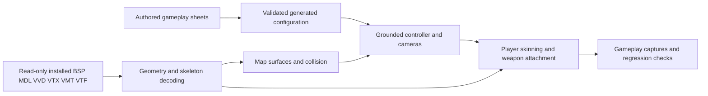

# Source sandbox fidelity acceptance checklist

Target: Drew's locally installed Garry's Mod sandbox on gm_construct. Original content is mounted read-only, never redistributed. This is a requirements and evidence ledger, not a claim that a Bevy/Rapier reconstruction is a complete Source engine. A checked build is not a visual parity check.

## Acceptance rules

- Compare the same model/skin/bodygroups, map position, camera angles, FOV, aspect ratio, graphics settings, and animation time against the original.
- Record observed behavior, implementation, and runtime verification separately.
- Every unchecked item remains a gap. Exact numerical/pixel parity requires original-game reference captures and measurements.
- Preserve the existing spreadsheet-to-generated-code pipeline, user saves, and Steam installation.

## Player assets and rendering

- [ ] Correct selected stock player model, no substitute primitive or unrelated mesh.
- [ ] MDL/VVD/VTX checksums, vertex fixups, mesh offsets, triangle lists/strips, LOD selection.
- [ ] Bodygroup selection instead of simultaneously rendering alternatives.
- [ ] Skin-family selection, model texture search paths, material patch resolution.
- [ ] Bone hierarchy, bind matrices, normalized weights, correct coordinate conversion.
- [ ] Idle, forward/backward/strafe walk, run, crouch idle/walk, jump, fall, land.
- [ ] Included animation models, external blocks, animation sections, signed compressed tracks.
- [ ] Pose parameters, animation blending, hold-type layers, aim pitch/yaw, foot IK.
- [ ] Face/eyes/blinking, flexes, mouth, jiggle/procedural bones.
- [ ] Lighting, normal/specular maps, cubemaps, phong, rim lighting, transparency.
- [ ] Model selection UI, hands mapping, player color, bodygroups, skins persist correctly.
- [ ] Ragdoll/death/respawn behavior, hitboxes and physics separately from visible mesh.

## First-person weapons and hands

- [ ] Physgun and toolgun original model geometry intact, no floating fragments.
- [ ] Bind pose evaluated into authored idle pose, correct camera-relative axes.
- [ ] Matching original arms/hands model, bone merge and skin choice.
- [ ] Separate viewmodel FOV, near plane, render layer and depth handling.
- [ ] Idle/draw/holster/attack/reload animations and correct event timing.
- [ ] Bob, sway, recoil, lowered/crouching/sprinting transitions.
- [ ] Physgun glow, animated claws, beam source at muzzle attachment.
- [ ] Toolgun screen, selected tool text, effects and sounds.
- [ ] Weapon switch cleans up old model and effects, no stale hidden mesh.
- [ ] UI capture and window focus never fire or rotate the camera accidentally.

## Third-person player and held weapon

- [ ] Toggle first/third person without moving the player or resetting aim.
- [ ] Camera follows player eye origin and collides with walls/ceilings.
- [ ] Body is visible in third person and hidden from first-person camera only.
- [ ] World weapon attaches to actual animated right hand, not camera or approximate screen offset.
- [ ] Left hand grips weapon through authored pose or IK.
- [ ] Weapon hold poses for physgun/toolgun and aiming pitch.
- [ ] Walk/run/strafe animation matches speed and heading without foot sliding.
- [ ] Aim trace remains based on player eye, not an offset third-person camera.
- [ ] Weapon effects align in both views and do not intersect the body.

## Grounded movement and collision

- [ ] Spawn at original info_player_start with correct feet/eye height and yaw.
- [ ] Walking is default, noclip is an explicit toggle.
- [ ] Horizontal movement independent of look pitch, normalized diagonal speed.
- [ ] Gravity, grounded detection, jump impulse, no mid-air repeated jump.
- [ ] Walk/run/slow speeds, acceleration, friction, air acceleration match measured reference.
- [ ] Standing/crouched hulls and eye heights, no standing through low ceiling.
- [ ] Step up/down, ramps, steep slopes, ledges, wall sliding, corner contacts.
- [ ] Floor and wall collision covers world brushes, brush entities and static props.
- [ ] Clip/playerclip brushes and invisible collision separate from visible materials.
- [ ] Moving platforms, elevators, doors, dynamic props and push interaction.
- [ ] Water contents, swimming, ladders, fall damage, spawn recovery.
- [ ] Fixed timestep stability, equivalent results at low/high rendering FPS.
- [ ] Noclip exit refuses embedding inside geometry.

## gm_construct completeness

- [ ] World faces triangulated with correct winding and plane-side normals.
- [ ] All visible brush submodels imported with entity origin and angles.
- [ ] Invisible trigger/clip/areaportal volumes not rendered as opaque walls.
- [ ] func_brush render mode/color/alpha and initial visibility respected.
- [ ] Indoor/outdoor walls visible from intended side, no missing building panels.
- [ ] Displacements, seams, blended ground materials and per-vertex normals.
- [ ] Static/dynamic props, skins, scale, orientation, collision and lighting.
- [ ] 2D sky orientation, 3D sky transform/scale, fog and distance clipping.
- [ ] LDR/HDR lightmaps, exposure/gamma, styles and dynamic lighting.
- [ ] Water reflections/refraction, underwater fog and surface animation.
- [ ] Glass, mirrors, decals, overlays, envmaps and material proxies.
- [ ] Doors/buttons/teleports/entity I/O, soundscapes and ambient effects.
- [ ] Visibility/PVS/areaportals and sensible performance without geometry loss.

## Sandbox behavior and full-copy boundaries

These requirements are also necessary for an actual one-to-one sandbox copy. Fixing the visible player alone does not complete them. Existing system discovery is in sheets and docs/PLAN.md.

- [ ] Spawn menu categories, search, icons, favorites, context menu, limits and permissions.
- [ ] Prop spawn position/orientation, mass, authored PHY hulls, friction, inertia, sleep.
- [ ] Physgun pickup, rotation, distance, freeze/unfreeze, multi-unfreeze and beam/audio.
- [ ] Gravity gun and stock weapons with exact firing, reload, ammo, damage and effects.
- [ ] All stock tools, constraints and their options, undo/cleanup/duplicator semantics.
- [ ] NPCs, navigation, AI schedules, combat, vehicles and seats.
- [ ] Lua API, hooks, entities, scripted weapons, gamemodes and addons.
- [ ] Networking, prediction, replication, ownership, multiplayer and server authority.
- [ ] Save/load compatibility, player settings, console/convars, binds, localization.
- [ ] Workshop/mounting compatibility, missing-content behavior and packaging rights.
- [ ] Audio mix/spatialization, particles, postprocessing, HUD and UI parity.
- [ ] Stability, resource limits, malformed asset handling and performance benchmarks.

## Initial findings, 2026-09-29

Code inspection confirms the initial viewer imports only BSP model 0 and static props. Brush entities are excluded. The camera is free-flying, with no player controller or body. The view weapons are static unposed meshes parented directly to the world camera. The existing vmdl decoder exposes bones and animation data, but its own animation reader has unsupported external blocks and questionable compressed-track semantics. These are concrete implementation gaps, not settings fixes.
