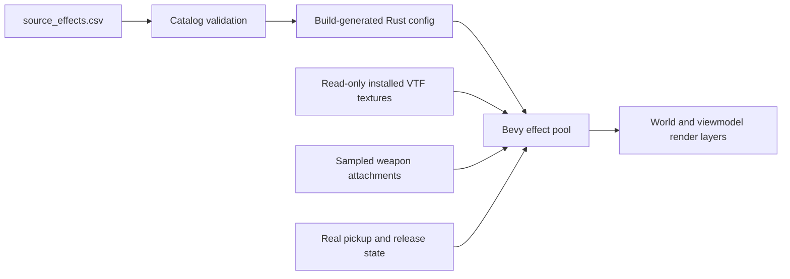

# Research record

Research date: 2026-09-29 UTC. Citation IDs are maintained in `sheets/sources.csv`.

## Reference-driven presentation repair, 2026-09-29

Drew's play feedback identified incorrect walking/jumping, missing beam and nonmatching menu layout. Read Facepunch's public `gamemodes/base/gamemode/animations.lua`, Sandbox `spawnmenu/spawnmenu.lua`, `creationmenu.lua`, `toolpanel.lua`, `creationmenu/content/content.lua`, `lua/vgui/spawnicon.lua`, and the `GM:DrawPhysgunBeam` wiki page. Exact URLs, observed rules, approximation labels and remaining work are in `sheets/presentation_references.csv`. The implementation plan is [PRESENTATION_PLAN.md](PRESENTATION_PLAN.md).

Reused existing Bevy `RelativeCursorPosition`, `ScrollPosition`, flex layout and `StandardMaterial`, Rapier's ray query and actual controller displacement, and the project's original-asset skeleton/clip decoder. No additional packages were introduced and no Valve/Facepunch implementation source was copied. Clip identifiers were taken from the previously inspected local animation metadata. The new runtime sheets are `source_layout.csv` and `source_animation_states.csv`.

The old animation path selected forward clips from global elapsed time regardless of airborne state. The old effects path required a valid held entity before drawing any beam. The old menu used unrelated 3%/5%/94%/82% placement and a 145px card grid. These code-level findings explain specific reported mismatches, but the corrected version remains subject to Drew's visual testing. Source activity layers, pose parameters and original skin rendering are still incomplete.

## Observed local baseline

- Steam app 4000 installation found through `libraryfolders.vdf` at `D:\SteamLibrary\steamapps\common\GarrysMod`.
- Manifest build ID 25375506. The installation was read only. No game files, saves, authentication or Steam settings were changed.
- First successful inventory: 2,904 loose files, 78,051 VPK entries across nine directory archives, 5,792 lexical Lua declaration candidates, 37 direct stock tool Lua files, zero skipped filesystem links.
- Combined asset records: **80,955**, not 80,955 unique artistic assets. Companion files, archive containers and duplicated virtual paths are separate records.
- Local gamemode directories: `base`, `sandbox`, `terrortown`. This does not mean those modes are implemented here.
- Tool declarations were inspected for categories, callback names and `TOOL.ClientConVar` defaults. High-level semantics in `tools.csv` remain summaries, not full line-by-line verified specifications.

## Public source scope

The Facepunch repository README says it contains Lua/text/config extensions and that binary sources are not public. Valve Source SDK 2013 README identifies HL2, HL2DM and TF2 game code. Its license grants specific Source 1 mod-related rights and distribution conditions, not unrestricted ownership of all code or assets. `gmod-module-base` exposes a native module interface. `garrysmod_common` is a community module-building utility, not the full engine.

These are useful research references. No Valve/Facepunch implementation was copied or mechanically translated into this repository. The installed source inventory remains in ignored local output. Reference behavior is independently approximated where implemented.

## Reuse decisions

The original installed-content pipeline and additional decoder research are recorded in [SOURCE_ASSETS.md](SOURCE_ASSETS.md). This replaces the earlier procedural-only visual target, not the preserved testbed or its tests.

1. **Bevy**, requested by Drew, supplies ECS, input, windowing, UI and rendering. Version 0.16.1 was selected with a compatible physics plugin, not because it was assumed newest.
2. **bevy_rapier3d 0.30.0** manifest explicitly targets Bevy 0.16. Its fixed-schedule API is used. This is an existing solver, not a new hand-written physics engine. The project has since moved upstream to the main Rapier repository, so future upgrades should consult that location.
3. **csv / serde / serde_json** handle typed authoring and persistence. Do not implement ad-hoc CSV parsing or silently accept invalid physical values.
4. **rust_xlsxwriter** creates the Excel review snapshot. It is optional so the core game build need not use the workbook feature.
5. **ValvePython/vpk** was consulted for directory header and entry layouts. Our bounded metadata-only parser is independently written. It supports directory versions 1/2 and does not extract, execute or decode payloads. The Valve Developer Wiki format page returned a bot-protection page, so it was not claimed as successfully inspected.
6. Macroquad was initially investigated before Drew requested Bevy. It is not a project dependency or implementation component.

Bevy uses MIT/Apache-2.0 licensing, Rapier uses Apache-2.0, and the serialization/workbook crates have their own permissive terms. Exact dependency versions are locked in Cargo.lock. Review dependency notices and asset rights before any distribution. No broad license over third-party content is asserted by this project.

## Physgun presentation research, 2026-09-29

- Read installed `materials/sprites/physbeam.vmt` and `materials/sprites/blueflare1_noz_gmod.vmt` through the existing read-only mount. The former references `sprites/physbeam_white`; the latter requests additive sprite rendering. Diagnostic text stays in ignored `local/effects-research.log`.
- Inspected original `models/weapons/w_physics.mdl` metadata. Its `core` and `fork*t` attachments provide effect positions. The viewmodel's available muzzle/fork attachments are transformed by the same sampled skeleton as its mesh. This reuses the existing MDL decoder and coordinate conversion rather than introducing a second asset pipeline.
- Reused Bevy 0.16 `StandardMaterial` additive blending, billboard quad meshes, render layers and mutable mesh assets. A fixed pool holds four weapon glow slots, one endpoint and one ribbon. Beam UVs scroll on the existing mesh instead of allocating a new GPU asset every frame.
- `sheets/source_effects.csv` authors texture references, color, widths, pulse and scroll parameters. These are independently chosen presentation parameters, not measured GMod constants. The beam's viewmodel start is adjusted for the separate world and viewmodel camera FOVs.
- No native renderer code was copied. Claw transitions, sound, configurable player color, exact grab anchors, illumination and paired original-game visual acceptance remain open. An additive sprite does not establish that the weapon illuminates nearby geometry.

## What has not been researched to completion

No full native engine implementation, exhaustive Lua API semantics, every game convar, all model/material formats, all stock map I/O entities, Workshop corpus, mounted game corpus, weapon/NPC stat corpus or numerical Source physics baseline has been reconstructed. The 64-system matrix is a discovery map that must be expanded into concrete reference cases during M2. The current runnable prototype is evidence for its own behavior only.

## Player and map repair research, 2026-09-29

- Inspected installed dependency sources for `vmdl 0.2.0`: `src/lib.rs`, `src/vvd/{mod,raw}.rs`, `src/mdl/raw/{header,bones,animation,mod}.rs`, and `src/compressed_vector.rs`. Geometry, VVD fixups and material lookup remain reused. Observed that its weight iterator divides by influence count, external animation blocks are unimplemented, compressed samples are unsigned, and frame indices narrow to u8.
- Added independently implemented bounded skeletal/selected-clip sampling using those format layouts. It preserves signed i16 runs, frame indices above 255, raw quaternion formats, external ANI blocks, section tables, bind matrices and attachment matrices. Full Source sequence layering, IK, flexes and procedural bones remain outside this implementation.
- Original local metadata shows Kleiner's player model contains its ragdoll animation, while stock locomotion and hold clips live in `models/m_anm.mdl` and its ANI blocks. Actual idle/walk/run physgun and pistol clips are used, not synthesized walking poses.
- Reused Rapier 0.30's KinematicCharacterController, autostep and grounded output. Its capsule/sliding behavior is not Source's box-hull movement solver. Models and movement dimensions are authored in `sheets/source_player.csv`.
- Inspected `vbsp 0.9.1` face triangulation and normals. Final visual review disproved the earlier face-side correction: the actual indexed planes already carry signed normals, so multiplying by `face.side` again inverted negative-axis surfaces and hid the white-room ceiling. Removed the duplicate flip. A real installed-map regression first failed with `ceiling faces away from room`. Local gm_construct has 12 non-world brush submodels, including interior func_brush walls, reflective glass, vehicle clips and illusionary surfaces. Diagnostic vertices confirm visible submodels use entity-local coordinates. Rendering only model 0 omitted this geometry.
- Original hands are bone-merged by name. World weapons use the authored `anim_attachment_RH` matrix, including its local orientation. Visual review caught the initial bone-only attachment pointing the gun down.
- Teeth/Eyes shaders are missing from vmt-parser. Their base textures now load through a VertexLitGeneric approximation, not equivalent lighting or eye animation.
- Full fidelity acceptance inventory is in [PLAYER_PARITY.md](PLAYER_PARITY.md). Proprietary payloads and diagnostic dumps remain local/ignored.

