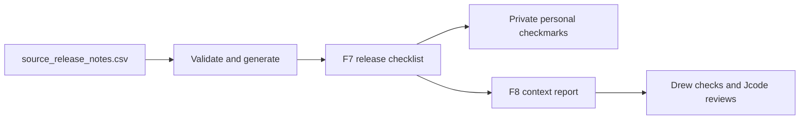
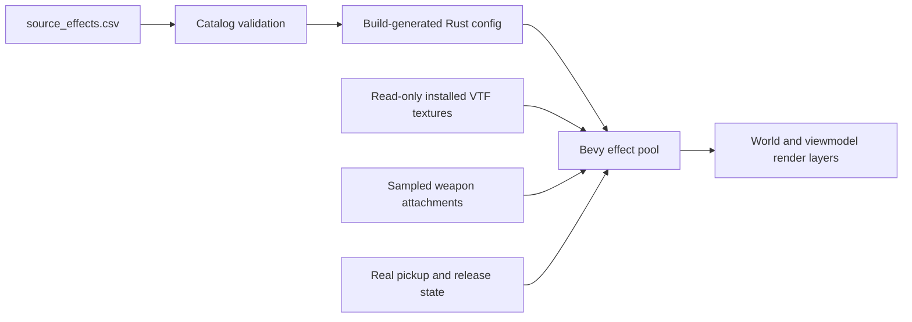

# Research record

## 2026-09-30 feedback regression follow-up

- User feedback rejected wheel axes and crouch speed in the previous release. Code inspection found a definite coordinate mismatch: `source_position` uses `(-y,z,-x)` but the new wheel code had assumed `(x,z,-y)`. Corrected the inverse basis. No original model assets were changed.
- Inspected the shared movement implementation and existing SDK `Friction`/`Accelerate` reference. At the authored 60 Hz and crouch speed, standing stop-floor friction exceeded one tick of acceleration. The repair bounds that floor only during active crouch movement, preserving release braking. This is deliberately documented as a prototype correction, not a sourced native formula change or measured gameplay result.
- [Facepunch EF enumeration](https://wiki.facepunch.com/gmod/Enums/EF) explicitly describes EF_BONEMERGE as matching parent/child bones by name. Reused that semantic and the existing hands-merging implementation for held world weapons instead of placing the whole model origin at the hand attachment. Full hold/aim layers and IK remain separate.
- [Valve CShotManipulator reference](https://github.com/ValveSoftware/source-sdk-2013/blob/master/src/game/shared/shot_manipulator.h) documents centered spread using combined uniform draws and unit-disc rejection with bias controls. Replaced the independent prototype's fixed-radius ring with centered bounded sampling. The new local xorshift-based stream does not reproduce Source command seeds, RNG, bias convars or weapon-specific accuracy/recoil state.
- Located the official [physgun guide](https://wiki.facepunch.com/gmod/Using_your_Physgun) and [prop_ragdoll overview](https://developer.valvesoftware.com/wiki/Prop_ragdoll) for continued reference work. Ragdolls are constrained collections of physics bodies, not one rigid prop. This pass did not parse PHY solids or implement articulated physics, all sound events, or universal aiming. Their detailed dependencies remain in feedback_followup.csv.
- Audited the complete current `source_tools.csv`: 13 partial rows including custom Freeze, 22 missing and 3 reference-only. This is an implementation inventory, not successful action-by-action acceptance. No tests, screenshots, audio playback or input automation were run.

## 2026-09-30 crouch, impact and wheel review

- Reviewed [Source SDK movement](https://github.com/ValveSoftware/source-sdk-2013/blob/master/src/game/shared/gamemovement.cpp), especially `CanUnduck`, `FinishDuck`, `FinishUnDuck` and duck timing. Grounded origin adjustment preserves feet, airborne adjustment raises feet, and unduck must trace the standing hull. This independent Rapier capsule implementation retains those broad rules but not Source box-hull or complete command/duck-jump semantics. The authored 36-unit duck height and 28-unit eye offset are prototype reference dimensions, not measured GMod acceptance. Conversion is 0.01905 m per Source unit.
- Read the installed `garrysmod/gamemodes/base/gamemode/player_class/player_default.lua`: crouched speed fraction 0.3 and duck/unduck timing 0.3. Original `models/m_anm.mdl` metadata provides `@cidle_physgun`, `@cidle_pistol` and `a_CrouchWalking_cwalk_{hold}_{direction}` for eight directions. Metadata existence is not successful clip decoding or visual acceptance.
- Read original `models/buggy.mdl`, `models/vehicle.mdl` and `models/combine_apc.mdl` wheel attachment metadata. Reused `wheel_fl/fr/rl/rr` bone pivots with the project's original skeletal decoder and CPU skinning. Native spin/turn/suspension clips were discovered but are not evaluated by this subset.
- Read mounted `scripts/vehicles/jeep_test.txt`, `jalopy.txt` and `apc_gmod.txt`: Jeep front/rear radii 18/22 units, Jalopy 18/19.5 and APC 28/28. Authored front steer uses slow-speed 50 degrees for Jeep/Jalopy and 36 for APC. Native fast/boost steering, suspension and full script parsing are not implemented. No original payload is redistributed.
- Read mounted `materials/decals/concrete/shot1.vmt`: original base texture `Decals/concrete/SHOT1`, DecalModulate and scale 0.10. An earlier guessed `decals/shot1.vmt` lookup failed and was corrected. Runtime reuses the mounted texture on an independently sized 0.08 m multiply-blended quad, not equivalent DecalModulate projection, size or shader behavior. Bursts are short line effects, not native particles or sound.
- Reused installed Rapier 0.30 `CONTACT_FORCE_EVENTS`, `ContactForceEventThreshold`, `ContactForceEvent` and solver-contact world points. Crash visuals respond to physical contacts rather than guessed deceleration. Threshold/cooldown are authored prototype tuning and do not implement vehicle damage.
- HUD is explicitly Source-inspired placement using existing Bevy text/layout, not a measured or reconstructed native HUD resource. FPS averages actual real-time frame durations rather than displaying a configured target.
- Original metadata outputs and all private feedback remain ignored under `local/`. No gameplay input, screenshots, benchmarks or tests were run for this research. See [feedback plan](FEEDBACK_REVIEW_PLAN.md) and [manual cases](../sheets/motion_impact_cases.csv).

## 2026-09-30 single-note Windows editing and presentation review

- Reviewed all four private reports locally. Public engineering scope is in FEEDBACK_REVIEW_PLAN.md and feedback_review_plan.csv, not copies of private notes.
- Reused Windows Rich Edit 4.1 (`Msftedit.dll`, `RICHEDIT50W`) as a child of the existing game HWND. Microsoft [Rich Edit overview](https://learn.microsoft.com/en-us/windows/win32/controls/about-rich-edit-controls) documents Unicode, editing and Text Services Framework support. [Edit controls](https://learn.microsoft.com/en-us/windows/win32/controls/about-edit-controls) provide the native cursor/selection contract missing from a Bevy label collecting keypresses. [Windows voice typing guidance](https://support.microsoft.com/en-us/windows/use-voice-typing-to-talk-instead-of-type-on-your-pc-fec94565-c4bd-329d-e59a-af033fa5689f) requires a focused text field and describes Win+H, microphone and network requirements. Windows owns the listening UI and speech privacy, not this application. End-to-end compatibility remains unaccepted.
- Installed Windows SDK 10.0.19041.0 `um/Richedit.h` supplies EM_EXLIMITTEXT (WM_USER+53), EM_SETTEXTMODE (+89), EM_SETEDITSTYLE (+204) and SES_USECTF (0x10000). The latter explicitly opts Rich Edit into TSF. Reused cached windows-sys 0.59 bindings plus raw-window-handle 0.6 rather than an external editor or speech service. Integration catalog lookup found no suitable provider; off-catalog windows-sys selection was recorded. Cargo.lock adds direct dependency edges only.
- Inspected installed winit 0.30.13 Windows dispatch and Bevy 0.16.1 RawHandleWrapper/ComputedNode APIs. Child editing remains in the same OS event loop, main-thread NonSend systems mirror text before frontend actions, and physical UI coordinates place the child after layout. GPU child-window composition, focus transitions and multi-monitor DPI remain manual acceptance boundaries.
- Original read-only metadata from ten mounted c_* weapon models supplies eleven combat routes. SMG/flechette use @fire01, AR2 uses @IR_idle/@IR_fire/@IR_reload/@IR_draw, RPG idle is @idle1, shotgun fire is @fire01 (its @fire has one frame), and grenade primary uses @throw. Crowbar/stunstick use @hitcenter1. Local metadata log was produced by the existing source-inspect --metadata utility, not clip decoding or gameplay. Existing animation loader/bone merge are reused. Shotgun reload phases and broader native activities remain open.
- Original mounted Sandbox `spawnmenu/creationmenu/content/contenttypes/weapons.lua` groups Weapon entries by Category and chooses IconOverride or entities/<ClassName>.png; NPC source follows analogous category/icon references. Existing spawn_reference.csv already carries these paths. The browser now uses those references and the existing mounted image decoder/cache, with model spawnicon fallback and an explicit absent-image label. No original scripts or assets are redistributed.

## 2026-09-30 feedback Space key and release checklist

- Reviewed the private local feedback inbox without modifying or uploading reports. The reported missing spaces match a source-level omission: all three text handlers only accepted `Key::Character`, while installed Bevy 0.16.1 `bevy_input/src/keyboard.rs` defines the spacebar as the separate logical `Key::Space`. Reused that API directly with a mutually exclusive match arm, preserving byte limits, key repeat and Unicode-safe Backspace. No external dependency or input automation was introduced.
- Reused the existing frontend page, scroll, button, pause, contextual-feedback and atomic JSON persistence patterns for a new F7 What's New / What to Test page. Content is authored in `source_release_notes.csv`, validated by the existing catalog frontend loader and emitted by the existing build generator. It is an independent development aid, not a claim about an original Garry's Mod menu.
- Integration review found that automatic weapons could inherit a left mouse button held while closing a menu. The existing equip-block latch now also requires release after frontend/Q-menu use. Frontend input is explicitly ordered before Q-menu search as well as player input. Unfocused frontend typing is discarded. These are static source findings, not runtime reproductions.
- The 13 initial cards summarize current implemented slices and known limitations. Personal checkmarks are keyed by stable ID plus revision and saved only in ignored `local/release-checklist.json`. They never promote project acceptance results. Existing feedback drafts retain their original context until explicitly retargeted. Fourteen Drew-owned acceptance scenarios are recorded in `release_checklist_cases.csv`.

## 2026-09-30 NPC lifecycle and player collision filtering

- Read installed `lua/autorun/base_npcs.lua` and `gamemodes/sandbox/gamemode/spawnmenu/creationmenu/content/contenttypes/npcs.lua`. The latter exposes Disable AI, Ignore Players, Keep Corpses, Auto Player Squad and weapon selection as separate controls. Only the first two are implemented in this package. Odessa explicitly has no weapon, and shotgun registrations remain disabled rather than becoming rifle substitutes.
- Read [Valve SDK npc_zombie.cpp](https://raw.githubusercontent.com/ValveSoftware/source-sdk-2013/master/src/game/server/hl2/npc_zombie.cpp): the classic and torso models are distinct, health is skill-convar-driven, native zombies have schedules and animation/sound events. This implementation does not claim those native systems. Authored health, speed, range and attack timing are prototype tuning.
- Read-only mounted model metadata confirmed classic zombie `@Idle01`, `a_walk1`, `@attackA`; torso `@Idle01`, `@crawl`, `@attack`; Combine models include `models/combine_soldier_anims.mdl` with `@CombatIdle1`, `a_WalkN`, `@shootAR2s`; Odessa includes `models/humans/male_shared.mdl` with `@idle_subtle` and `a_WalkN`. Explicit sheet mappings select these libraries. Geometry and CPU skeletal posing reuse existing `source_models`, `source_animation` and `source_player` implementations, with no added dependency or bundled asset.
- The first metadata-only inspection reached an existing vmdl external-animation panic. Reused the production geometry loader's zero-animation-count header copy to avoid eager decoding, while preserving original bytes for raw animation-name metadata. Repaired extraction and included-library extraction completed. This was metadata reading, not animation playback or gameplay acceptance. Logs remain ignored under local/.
- Read installed `gmod_tool/stools/nocollide.lua`: left click creates a pair-specific NoCollide constraint; right click toggles COLLISION_GROUP_WORLD versus NONE. Rapier 0.30 `KinematicCharacterController.filter_groups` defaults to None, and its update system does not inherit the collider's groups. The player now supplies its GROUP_3 mask explicitly so world-only props remain map-colliding but do not obstruct player sweeps. Vehicle exit/respawn hull queries use the same player mask. The reported failure is source-diagnosed, not gameplay-reproduced.
- Stock code was read for behavioral research only. No proprietary Lua, models, animation payloads, saves or private feedback are committed. The implementation and open work are separated in REMAINING_PARITY_PLAN.md and the authored sheets.

## 2026-09-29 vehicle orientation, stock categories and water correction

Drew reported sideways airboat driving, missing useful model categories and poor water. Reviewed the local feedback report privately without copying it into Git. Reused the existing mounted archive reader, MDL Skeleton bind hierarchy, vmt-parser and Bevy StandardMaterial rather than adding dependencies. Added a `source-inspect --metadata` mode that reads mounted metadata without animation decoding checks, gameplay or screenshots.

Read installed base_vehicles.lua and all 15 registered model attachment frames. Powered Jeep/Jalopy/APC/Airboat `vehicle_driver_eyes` and feet attachments resolve to converted +X forward, corresponding to yaw -pi/2 from Bevy -Z. Existing drive code incorrectly used -Z for every mesh. Converted airboat eyes are (-0.2095504, 1.1866086, 0) meters and feet (-0.2095504, 0.6532086, 0). All ten chair/seat registrations use converted -Z. Pod eyes use +X but no feet attachment exists, so pod feet height remains explicitly estimated. Source positions use (-y,z,-x)*0.01905. The authored sheet now records per-model heading, feet and eye height. Native entry clips and physical tuning remain unverified.

Read Valve SDK `src/game/server/hl2/vehicle_airboat.cpp` from <https://github.com/ValveSoftware/source-sdk-2013/blob/master/src/game/server/hl2/vehicle_airboat.cpp>, including attachment use, view dampening and native entry/exit responsibilities. An initial URL lacking hl2 returned 404 and was not evidence. Public code alone did not establish imported model axes, so actual installed bind attachments supplied that evidence. Archived scripts/vehicles/airboat.txt was successfully read through the existing mounts; this corrects the earlier assumption that absence of a loose directory prevented access. Native script values are not yet applied to the independent chassis.

Stock categories come from 43 original settings/spawnlist_default files, their parentid/id/name fields and ordered model/header entries. scripts/catalog-model-categories.ps1 extracted 8,390 unique model/category memberships with source lines. One model can belong to multiple lists. Runtime intersects these with mounted models and retains a readable fallback for unlisted assets. The first extractor matched a type value as a model key, failed before producing output, then was corrected to anchored keys. This is lexical extraction of installed flat content blocks, not arbitrary user KeyValues execution or addon compatibility.

Read original gm_construct/water_13 and water_13_beneath VMTs: above-water flags 1 and 0, shared gm_construct/water_13_normal, fog colors {7 58 66} and {24 64 72}, fog ends 1024 and 2048 HU. vmt-parser returns those byte-range colors unchanged, so the prior /255 conversion was correct for these assets. The defects instead included ignoring the original normals/optics, treating water as an unlit opaque color and classifying collision by material-name substring. Above/below shader groups were both submitted rather than represented as a single boundary. Source inspection identifies a plausible coplanar-blinking contributor, not a measured reproduction.

Read installed Bevy 0.16.1 StandardMaterial transmission, attenuation, normal-map, UV-transform and tangent APIs. The replacement uses linear mipmapped original normals, authored UV drift, dielectric reflection/refraction parameters and volume tint without water lightmaps. It renders the above boundary two-sided and suppresses separate underwater variants. This is a Bevy approximation, not Source planar reflection, animated VTF playback or underwater volumetric fog. Visual quality and GPU behavior still require Drew's acceptance. See VEHICLE_WATER_CATEGORY_PLAN.md and vehicle_water_category_cases.csv.

## 2026-09-29 playable weapon and vehicle integration

Reused installed Facepunch registrations and menu action semantics from the preceding discovery pass, the tracked original-model inventory, the existing async model preparation/physics/save pipeline and installed player animation metadata. Read `lua/weapons/weapon_flechettegun.lua`: automatic unlimited-ammo primary cadence is 0.1 seconds and native projectile speed is 2000 HU/s (38.1 m/s at the existing conversion). Native sticking/effects/sound remain absent. Public counterpart: <https://github.com/Facepunch/garrysmod/blob/master/garrysmod/lua/weapons/weapon_flechettegun.lua>.

The local animation inventory lists drive_jeep_center, drive_airboat_center, @drive_pd and @sit. These supply optional seated poses, not native entry/exit cinematics. Weapon clip names are candidates with explicit fallback diagnostics, not individually verified asset acceptance. Enabled weapon model paths were matched against the tracked model inventory. No Steam asset was modified or copied into Git.

No loose installed scripts/vehicles directory was available. Native archived vehicle scripts have not been parsed. Chassis, suspension, wheel-ray support, surface-triangle airboat support, generic prop health and most firearm tuning are independent prototypes, not measured Source engine equivalents. Native damage classes, secondary attacks, fluid volumes, transmission, sounds, multiplayer and all NPC AI remain separate work. Read installed bevy_rapier3d 0.30.0 query APIs and reused intersections_with_shape for exit hull clearance after the compiler rejected the singular context method.

Authored source_weapons.csv covers all 34 cataloged weapons, source_vehicles.csv all 15 vehicles, and source_gameplay.csv shared tuning. Derived playable_coverage.csv records every route and its remaining work. All acceptance remains not_run. See PLAYABLE_ENTITIES_PLAN.md.

## 2026-09-29 entity and creation-menu discovery

Read installed Facepunch stock NPC/vehicle/item registrations, Sandbox spawn commands, creation/content/context menus, content-icon implementation and scripted entity/weapon declarations. Reused their metadata and documented semantics, not executable Lua. The reproducible read-only extractor is `scripts/catalog-spawn-reference.ps1`. It produced 197 spawn definitions, 1,406 literal menu-control records and 178 source hashes. Existing HTML/CSS/native-menu research remains intact. Detailed findings, bounds and the next vehicle/NPC implementation sequence are in [ENTITY_MENU_SOURCE_OF_TRUTH.md](ENTITY_MENU_SOURCE_OF_TRUTH.md). The sources are the installed counterparts of <https://github.com/Facepunch/garrysmod>. Discovery does not demonstrate native behavior or pixel parity, and conditional mount availability is not evaluated.

Research date: 2026-09-29 UTC. Citation IDs are maintained in `sheets/sources.csv`.

## Reported running drift: correction to the preceding movement pass

Drew reported drifting after the context/movement build. The earlier pass incorrectly selected **generic SDK friction 4** as the GMod runtime baseline. Read installed `lua/autorun/utilities_menu.lua:8-14,21-40,57-61`: the authored GMod server preset has **sv_friction 8**, gravity 600 and sticktoground 1. LoadInConvarDefaults can replace these with engine GetDefault values, so this is direct installed preset evidence, not a dump of live native convars. The spreadsheet now uses 8. This is a correction to our implementation, not a request for Drew to compensate by adjusting controls. Source R14 records the installed/public definition.

Expanded the R12 read to gamemovement.cpp Friction (1610-1677), Accelerate (1820-1852), StayOnGround (1857-1888), WalkMove (1893-2018), FullWalkMove (2023 onward), CheckJumpButton (2352-2527), TryPlayerMove (2550 onward), ClipVelocity (3144-3187) and CategorizePosition (3794-3913). Grounded movement clears vertical velocity before friction and walking and after final gravity. WalkMove stops speeds below 1 HU/s. Position traces and steps do not redefine velocity as displacement/dt. Collision clipping modifies inward velocity components and handles multiple blocking planes separately. Ground categorization uses a 2 HU probe and normal >=0.7. Native step/hull/quadrant tracing remains different from Rapier.

Read installed bevy_rapier3d 0.30.0 `plugin/systems/character_controller.rs` and `plugin/plugin.rs`, plus rapier3d 0.25.1 `control/character_controller.rs` (R15). SyncBackend runs the character controller before transform propagation and body synchronization; output is refreshed and translation consumed there. Effective translation includes normal nudges, stair/snap corrections and possible kinematic-platform translation. It is not final physical velocity. The old feedback path divided that displacement by dt and persisted it as momentum. The revised pre/post-physics phases preserve velocity, clip against blocking contact planes, clear landing/ceiling velocity appropriately, and apply Sandbox FinishMove boost after contacts. Actual displacement remains animation/diagnostic data only.

Both Bevy fixed time and Rapier are already explicitly 1/60s, so no timestep mismatch was found and the tick rate was not changed. Airborne autostep is now disabled. Ground support probing is kept separate from gravitational velocity, using the sheet-authored 2 HU distance with Rapier snapping. Ramp/stair/corner and broad Rapier grounded semantics still require real acceptance. The exact changes, equations, remaining differences and unrun regression cases are in [MOVEMENT_REPAIR.md](MOVEMENT_REPAIR.md). No feedback reports existed on inspection, no active game was terminated, and no tests or automated gameplay were performed.

## Source movement and contextual feedback, 2026-09-29

Read Valve Source SDK 2013 `src/game/shared/gamemovement.cpp` (Friction, AirAccelerate, FullWalkMove and CheckJumpButton), `gamemovement.h` and `movevars_shared.cpp` from the public Valve repository (R12). Ground friction uses max(speed, stop speed); air acceleration limits velocity projected onto the wish direction to 30 Hammer units/s but uses uncapped wish speed in the acceleration term. A successful fresh jump precedes ground friction. Held Space alone is not automatic bunny hopping. Gravity uses half steps around movement. SDK baseline values are acceleration 10, air acceleration 10, friction 4 and stop speed 100 HU/s. These are reference baselines, not measurements of the installed GMod native binary. The Valve Developer Wiki Bunnyhop page returned an anti-bot response and was not used as read evidence.

Read the installed `gamemodes/base/gamemode/player_class/player_default.lua` and `gamemodes/sandbox/gamemode/player_class/player_sandbox.lua` without modifying Steam (R13). Sandbox specifies walk 200/run 400/slow 100 HU/s and inherits jump power 200. Its StartMove/FinishMove jump boost uses standing fraction 0.5 (crouched 0.1), deliberately preserves sprint boost, bounds horizontal speed against moveMaxSpeed*(1+fraction), and reverses the addition for backward travel. This differs from treating bunny hopping as unlimited forward acceleration. Existing scale 0.01905 m/HU yields walk 3.81, run 7.62, jump 3.81, stop speed 1.905 and air projection cap 0.5715 in SI units.

The independent Rust controller now retains collision-resolved planar momentum, applies the researched acceleration/friction rules, uses fresh-press jumps and a pending post-move Sandbox boost. Authored constants remain in source_player.csv. Rapier capsule/contact/step behavior is not Source hull sliding. Crouch, water, ladders, surf, moving platforms, ceiling response, surface friction, exact command timing and native frame-rate parity remain incomplete or unverified. movement_reference.csv separates each implemented rule from remaining work and Drew-owned acceptance.

Cursor inspection found that menu closure previously depended on another click to recapture. A single final cursor synchronization now derives capture from window focus and actual UI state. Contextual feedback reuses Bevy RelativeCursorPosition, existing UI actions and serde JSON. F8 or browser/tool-panel feedback captures context before the editor opens, preserves unsent-draft context, and returns to the originating page/menu. No new service, dependency, upload, agent loop or screenshot capture was added. Reports stay private in ignored local/feedback. No reports were present when reviewed for this request. See CONTEXT_MOVEMENT_PLAN.md.

## Nonworking menu repair and exact layout inventory, 2026-09-29

Drew reported that the previous menu did not work and did not match stock placement. Read installed `html/template/main.html`, `newgame.html`, `menu.html`, `css/menu/PageOptions.css`, `NavBar.css`, `NewGame.css`, `Menu.css`, and `js/menu/control.NewGame.js`. Inspected the actual 288x128 Sandbox logo and one installed 1920x1080 PNG background. Stock main text starts at CSS x=50+20+16=86, not the prior 16px sidebar. Stock footer is 50px high. New Game has an independently anchored white map list and a 226px settings panel. The 46 rules in menu_reference.csv retain locations, selectors, responsive conditions and unimplemented boundaries.

Inspected Bevy 0.16.1 `ui_node.rs` and `focus.rs:298-323`: Text and ImageNode require Node, whose FocusPolicy defaults to Block. The previous button children had no Pass policy, so label/image hits stop before their owning Button. Explicit pass-through decorations reuse the framework's actual hit-test system, not a separate rectangle-click engine. A changed-Interaction collector emits actions only on a fresh physical left press. Q-menu labels and model thumbnails receive the same correction. This diagnosis is from source inspection, not a gameplay test.

The view reuses read-only mounted original PNGs and Windows Arial/Arial Bold (CSS fallback), with existing font defaults if unavailable. No artwork or fonts are copied into the repository. Background choice is authored and aspect-filled, not the native rotating background implementation. Native text letter spacing, blurred shadows, gradients and complete subpages still require work and Drew's comparison.

`scripts/catalog-menu-reference.ps1` additionally inventories **140 literal controls** from the seven installed loose Options*.res files, preserving raw position/size/visibility/tab fields, and **30 Sandbox new-game settings** from sandbox.txt. These are metadata, not copied implementation source. Extraction is lexical for flat blocks and does not resolve inherited controls, proportional coordinates, archive-only resources or dynamic engine values. Native options are no longer an unenumerated generic row, but this is not exhaustive native engine discovery. See MENU_REPAIR_PLAN.md.

## Expanded menu audit and follow-through, 2026-09-29 19:28 UTC

Re-read installed PageOptions.css, NavBar.css, NewGame.css, menu.html and newgame.html. The expanded inventory records 368 literal HTML controls/labels and 1138 CSS layout/style declarations across menu templates including nested creations and all HTML CSS subdirectories, in addition to 140 native controls and 30 Sandbox options. This is an exhaustive pass over the scanner's stated literal files and properties, not complete dynamic native/Lua coverage. Quoted comparison operators are retained while HTML comments are excluded. Source lines are kept to resolve media conditions and inherited/repeated control ancestors.

Corrected missing Problems/Games footer labels and the <=940px compact-label/15px-center-margin rule. Added page-preserving Games/Language/Gamemodes popup anchors from NavBar.css, with explicit unsupported backend notices and outside-click/Escape dismissal. English and Sandbox are the only active choices, not invented compatibility. Reference NewGame.css:7-28 specifies a normal favorite star visible on map hover or saved favorites, changing to add/remove only when hovering the star. The independent view now follows those states using Bevy RelativeCursorPosition and mounted images. No new package, third-party source copy, screenshot or input automation was introduced. No local feedback directory existed at review time.

## Startup, pause, feedback and spawn placement, 2026-09-29

Read the installed `html/css/menu/Menu.css`, `html/css/menu/NewGame.css` and `resource/localization/en/main_menu.properties` under the unmodified Garry's Mod installation. NewGame.css specifies 128px thumbnails, 6px card padding, 2px card margin, 16px outer inset, 190px controls and a 226px game-settings region. Menu.css specifies the Helvetica/Arial family, 32px category titles and a 50px footer exclusion. These observations are references, not proof that the current independent Bevy layout matches them. `source_frontend.csv` authors the reused dimensions alongside independently chosen font size, row height, feedback limit and spawn clearance. Stock typography, map images, footer and full options remain pending.

Reused existing Rapier surface traces and cached decoded model vertices for support-plane spawn placement, existing local scene serialization for menu saves, Bevy UI/input/virtual time, and standard-library child processes for startup/map handoff. No new package or proprietary payload was introduced. Feedback reports are local JSON in ignored `local/feedback`, not an upload or automatic agent turn. See FRONTEND_PLAN.md and frontend_cases.csv for precise implementation and open requirements.

## Toolgun and stock tools, 2026-09-29

Drew requested firing animation, a selected-tool screen, and complete tools/settings. The detailed execution plan and explicit unfinished scope are in [TOOL_IMPLEMENTATION_PLAN.md](TOOL_IMPLEMENTATION_PLAN.md). No claim of full tool or Source parity is made.

Read the installed/public `gmod_tool/shared.lua`, `cl_viewscreen.lua`, `cl_init.lua`, and the axis, ballsocket, colour, elastic, material, nocollide, physprop, remover, rope, slider and weld stool callback bodies. Public root: <https://github.com/Facepunch/garrysmod/tree/master/garrysmod/gamemodes/sandbox/entities/weapons/gmod_tool>. Successful tool callback results trigger the original firing sequence/effects, rather than every input click. Stock hold type is revolver, and stock effects include ToolTracer, selection_indicator and Toolgun.Single. Our first-person fire clip is wired, but the original sound, exact effects and third-person gesture remain missing.

The installed screen code specifies the `models/weapons/v_toolgun/screen` surface, screen_bg background, 256x256 target, 60px Helvetica weight 900, text center y=104, 250px/s scrolling and 64px gap. Current Bevy text uses its default font and lacks the original shadow, so source-derived dimensions do not establish pixel equivalence. Tool-specific DrawToolScreen overrides are not implemented. Read-only original model metadata identifies `@fire01` as a 20-frame toolgun animation. This metadata inspection is not a gameplay firing test.

`scripts/catalog-tool-settings.ps1` inventories 170 literal ClientConVar defaults from the installed loose stools without copying Lua source. It does not evaluate Lua, dynamic registrations or full panel definitions. Missing-tool action descriptions in source_tools are planning summaries, not fully verified callback specifications. The 39 authored runtime settings distinguish enabled operations from pending options. Material ranges and Rapier physical coefficients are independently authored approximations, not measured Source values.

Reused Bevy's version-matched UI render-target approach: <https://github.com/bevyengine/bevy/blob/v0.16.1/examples/ui/render_ui_to_texture.rs>. Reused the existing original model/clip decoder, mounted material/texture path, effect pool, UI controls, Rapier GenericJoint/ImpulseJoint child-body support and serde scene serialization. Rapier API source inspected from installed bevy_rapier3d 0.30.0 (`dynamics/joint.rs`, `generic_joint.rs`, `rope_joint.rs`, `spring_joint.rs`). No new package or proprietary payload was added. Tool physics, save documents and dispatch are independent Rust implementations, not copied Lua or native compatibility.

## Spawn responsiveness repair, 2026-09-29

Drew reported continuing lag, especially spawning an item. Static inspection found unoptimized engine/physics/decoder dependencies in the dev build, synchronous model/VTF/mipmap/convex-hull preparation inside the exclusive game update, deep geometry copies on every model-cache hit, idle aim queries, and unchanged HUD/projection/config writes. These are observed code paths, not measured proportions of frame cost.

Reused Bevy's documented optimized dependency profile (`[profile.dev.package."*"] opt-level = 3`), its existing `AsyncComputeTaskPool`, `Task`, and `block_on(poll_once(...))` completion pattern, and standard-library `Arc` for immutable mounted assets and cached geometry. Sources: <https://bevy.org/learn/quick-start/getting-started/setup/> and the version-matched example <https://github.com/bevyengine/bevy/blob/v0.16.1/examples/async_tasks/async_compute.rs>. No new dependency or agent worker was added. One bounded game-internal preparation task avoids concurrent decode storms. Exact duplicate hull input points are removed, not simplified into a different collision shape. Physics tick rate, mass, gravity, CCD and render detail are unchanged.

`source_performance.csv` supplies queue bounds and passive diagnostic settings through the normal typed build pipeline. `performance_cases.csv` records scenario-level implementation and remaining acceptance. GPU upload, icon loading, CPU skinning and original collision-solid parity remain explicit boundaries. See [PERFORMANCE_PLAN.md](PERFORMANCE_PLAN.md). No measured speedup or complete one-to-one parity is claimed.

## Reference-driven presentation repair, 2026-09-29

Drew's play feedback identified incorrect walking/jumping, missing beam and nonmatching menu layout. Read Facepunch's public `gamemodes/base/gamemode/animations.lua`, Sandbox `spawnmenu/spawnmenu.lua`, `creationmenu.lua`, `toolpanel.lua`, `creationmenu/content/content.lua`, `lua/vgui/spawnicon.lua`, and the `GM:DrawPhysgunBeam` wiki page. Exact URLs, observed rules, approximation labels and remaining work are in `sheets/presentation_references.csv`. The implementation plan is [PRESENTATION_PLAN.md](PRESENTATION_PLAN.md).

Reused existing Bevy `RelativeCursorPosition`, `ScrollPosition`, flex layout and `StandardMaterial`, Rapier's ray query and actual controller displacement, and the project's original-asset skeleton/clip decoder. No additional packages were introduced and no Valve/Facepunch implementation source was copied. Clip identifiers were taken from the previously inspected local animation metadata. The new runtime sheets are `source_layout.csv` and `source_animation_states.csv`.

The old animation path selected forward clips from global elapsed time regardless of airborne state. The old effects path required a valid held entity before drawing any beam. The old menu used unrelated 3%/5%/94%/82% placement and a 145px card grid. These code-level findings explain specific reported mismatches, but the corrected version remains subject to Drew's visual testing. Source activity layers, pose parameters and original skin rendering are still incomplete.

## Observed local baseline

- Steam app 4000 installation found through `libraryfolders.vdf` at `D:\SteamLibrary\steamapps\common\GarrysMod`.
- Manifest build ID 25375506. The installation was read only. No game files, saves, authentication or Steam settings were changed.
- First successful inventory: 2,904 loose files, 78,051 VPK entries across nine directory archives, 5,792 lexical Lua declaration candidates, 37 direct stock tool Lua files, zero skipped filesystem links.
- Combined asset records: **80,955**, not 80,955 unique artistic assets. Companion files, archive containers and duplicated virtual paths are separate records.
- Local gamemode directories: `base`, `sandbox`, `terrortown`. This does not mean those modes are implemented here.
- Tool declarations were inspected for categories, callback names and `TOOL.ClientConVar` defaults. High-level semantics in `tools.csv` remain summaries, not full line-by-line verified specifications.

## Public source scope

The Facepunch repository README says it contains Lua/text/config extensions and that binary sources are not public. Valve Source SDK 2013 README identifies HL2, HL2DM and TF2 game code. Its license grants specific Source 1 mod-related rights and distribution conditions, not unrestricted ownership of all code or assets. `gmod-module-base` exposes a native module interface. `garrysmod_common` is a community module-building utility, not the full engine.

These are useful research references. No Valve/Facepunch implementation was copied or mechanically translated into this repository. The installed source inventory remains in ignored local output. Reference behavior is independently approximated where implemented.

## Reuse decisions

The original installed-content pipeline and additional decoder research are recorded in [SOURCE_ASSETS.md](SOURCE_ASSETS.md). This replaces the earlier procedural-only visual target, not the preserved testbed or its tests.

1. **Bevy**, requested by Drew, supplies ECS, input, windowing, UI and rendering. Version 0.16.1 was selected with a compatible physics plugin, not because it was assumed newest.
2. **bevy_rapier3d 0.30.0** manifest explicitly targets Bevy 0.16. Its fixed-schedule API is used. This is an existing solver, not a new hand-written physics engine. The project has since moved upstream to the main Rapier repository, so future upgrades should consult that location.
3. **csv / serde / serde_json** handle typed authoring and persistence. Do not implement ad-hoc CSV parsing or silently accept invalid physical values.
4. **rust_xlsxwriter** creates the Excel review snapshot. It is optional so the core game build need not use the workbook feature.
5. **ValvePython/vpk** was consulted for directory header and entry layouts. Our bounded metadata-only parser is independently written. It supports directory versions 1/2 and does not extract, execute or decode payloads. The Valve Developer Wiki format page returned a bot-protection page, so it was not claimed as successfully inspected.
6. Macroquad was initially investigated before Drew requested Bevy. It is not a project dependency or implementation component.

Bevy uses MIT/Apache-2.0 licensing, Rapier uses Apache-2.0, and the serialization/workbook crates have their own permissive terms. Exact dependency versions are locked in Cargo.lock. Review dependency notices and asset rights before any distribution. No broad license over third-party content is asserted by this project.

## Physgun presentation research, 2026-09-29

- Read installed `materials/sprites/physbeam.vmt` and `materials/sprites/blueflare1_noz_gmod.vmt` through the existing read-only mount. The former references `sprites/physbeam_white`; the latter requests additive sprite rendering. Diagnostic text stays in ignored `local/effects-research.log`.
- Inspected original `models/weapons/w_physics.mdl` metadata. Its `core` and `fork*t` attachments provide effect positions. The viewmodel's available muzzle/fork attachments are transformed by the same sampled skeleton as its mesh. This reuses the existing MDL decoder and coordinate conversion rather than introducing a second asset pipeline.
- Reused Bevy 0.16 `StandardMaterial` additive blending, billboard quad meshes, render layers and mutable mesh assets. A fixed pool holds four weapon glow slots, one endpoint and one ribbon. Beam UVs scroll on the existing mesh instead of allocating a new GPU asset every frame.
- `sheets/source_effects.csv` authors texture references, color, widths, pulse and scroll parameters. These are independently chosen presentation parameters, not measured GMod constants. The beam's viewmodel start is adjusted for the separate world and viewmodel camera FOVs.
- No native renderer code was copied. Claw transitions, sound, configurable player color, exact grab anchors, illumination and paired original-game visual acceptance remain open. An additive sprite does not establish that the weapon illuminates nearby geometry.

## What has not been researched to completion

No full native engine implementation, exhaustive Lua API semantics, every game convar, all model/material formats, all stock map I/O entities, Workshop corpus, mounted game corpus, weapon/NPC stat corpus or numerical Source physics baseline has been reconstructed. The 64-system matrix is a discovery map that must be expanded into concrete reference cases during M2. The current runnable prototype is evidence for its own behavior only.

## Player and map repair research, 2026-09-29

- Inspected installed dependency sources for `vmdl 0.2.0`: `src/lib.rs`, `src/vvd/{mod,raw}.rs`, `src/mdl/raw/{header,bones,animation,mod}.rs`, and `src/compressed_vector.rs`. Geometry, VVD fixups and material lookup remain reused. Observed that its weight iterator divides by influence count, external animation blocks are unimplemented, compressed samples are unsigned, and frame indices narrow to u8.
- Added independently implemented bounded skeletal/selected-clip sampling using those format layouts. It preserves signed i16 runs, frame indices above 255, raw quaternion formats, external ANI blocks, section tables, bind matrices and attachment matrices. Full Source sequence layering, IK, flexes and procedural bones remain outside this implementation.
- Original local metadata shows Kleiner's player model contains its ragdoll animation, while stock locomotion and hold clips live in `models/m_anm.mdl` and its ANI blocks. Actual idle/walk/run physgun and pistol clips are used, not synthesized walking poses.
- Reused Rapier 0.30's KinematicCharacterController, autostep and grounded output. Its capsule/sliding behavior is not Source's box-hull movement solver. Models and movement dimensions are authored in `sheets/source_player.csv`.
- Inspected `vbsp 0.9.1` face triangulation and normals. Final visual review disproved the earlier face-side correction: the actual indexed planes already carry signed normals, so multiplying by `face.side` again inverted negative-axis surfaces and hid the white-room ceiling. Removed the duplicate flip. A real installed-map regression first failed with `ceiling faces away from room`. Local gm_construct has 12 non-world brush submodels, including interior func_brush walls, reflective glass, vehicle clips and illusionary surfaces. Diagnostic vertices confirm visible submodels use entity-local coordinates. Rendering only model 0 omitted this geometry.
- Original hands are bone-merged by name. World weapons use the authored `anim_attachment_RH` matrix, including its local orientation. Visual review caught the initial bone-only attachment pointing the gun down.
- Teeth/Eyes shaders are missing from vmt-parser. Their base textures now load through a VertexLitGeneric approximation, not equivalent lighting or eye animation.
- Full fidelity acceptance inventory is in [PLAYER_PARITY.md](PLAYER_PARITY.md). Proprietary payloads and diagnostic dumps remain local/ignored.
