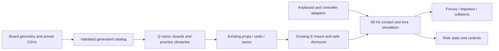

# Skateboarding integration plan

Four selectable independent presets: Real-world oriented, Skate-inspired flick control, Session-inspired dual-foot control, and Sandbox assisted. They are not extracted commercial-game physics or a port of an unspecified GMod addon. All numeric tuning is authored in CSV. Gameplay acceptance belongs to Drew.

## Plan
1. Research public mechanics and control models. Keep real-world principles separate from authored assists.
2. Author four profiles and one board configuration, plus exhaustive feature/acceptance ledger.
3. Reuse existing vehicle occupancy and prop persistence. Add original procedural deck/wheels and a practice rail/bank rather than copying proprietary models.
4. Implement four-contact support, front/rear truck steering, load-bounded lateral friction, rolling resistance, discrete pushing, braking/powerslide, charge/release pop, airborne rotation/flip input, catch and landing checks, manual balance and explicit practice-rail grind support.
5. Add discoverable menu options, keyboard and gamepad controls, stance choice, readable HUD and F7 checks. Clear pending inputs on blocked gameplay and never terminate the running game.
6. Compile the actual executable, validate production CSV and export workbook. Review and commit explicit paths. No agent gameplay tests, screenshots, Clippy or benchmarks.

## Research
- https://session-skatesim.com/en describes dual sticks representing feet. This establishes a control concept, not engine parameters.
- https://annex.exploratorium.edu/skateboarding/ explains deck/trucks/wheels and physical principles. An ollie involves tail impact, rider jump and front-foot leveling. Our aggregate-body pop impulse is explicitly an approximation.
- Skate series Flick-It reference requires a loaded/downward stick followed by a flick, rather than a generic jump button. No closed-source constants are claimed.
- GMod addons differ, and no single addon was selected. Sandbox is an independent assisted preset, not an addon clone.

## Fidelity boundaries
Native motion-captured rider actions, foot IK, separate articulated rider/board coupling, arbitrary-world grind recognition, complete grab/trick catalog, coping/vert transfer logic, exact commercial input timing and real-world calibrated tire/truck parameters remain acceptance/backlog work. A playable shared foundation does not establish one-to-one parity. No proprietary asset or implementation code is copied.

## Delivered integration and controls

- Q > Vehicles: choose one of four boards, practice rail or bank. Spawn onto nearby clear ground. E or XInput Y mounts/dismounts. Frozen or upside-down boards reject entry. The stance button or T changes regular/goofy. F4 retains the existing camera. Camera look remains mouse-driven.
- W / gamepad A pushes; S / B brakes; A-D / left stick carves. Session-inspired steering uses LT/RT instead of the left stick. Shift / LB powerslides.
- Realism and Sandbox: hold/release Space or gamepad X. Skate-inspired: Space release or right stick down then up. Session-inspired: Space loading plus Up arrow, or right-stick down loading plus left-stick up. Release all commands after a menu, focus interruption or mount transition before controls rearm.
- In air: J/L flips (right stick X, or left stick X for dual-foot), I/K spins (D-pad left/right), C / RB catches. Ctrl reverses pop pitch for a keyboard nollie approximation. No controller nollie mapping yet.
- M/N or D-pad down/up requests rear/front-truck balance. This removes the opposite support rays and applies approximate weight-shift and balance torque, not articulated feet. G / LB enables aligned support only on the authored practice rail. Pop exits support.
- Per-board preset and virtual model identity persist through the existing scene format and duplication. Momentum, live trick phase and global stance are not persisted. Bail releases the existing player occupancy without ragdoll; if nearby exits are blocked, the existing entry-position fallback applies.
- Suspension rays and rigid wheel colliders are a hybrid approximation. Visible suspension compression, moving-ground-relative friction, swept rider collisions, calibrated inertia, real deck concavity and full skate animations remain open. Strict profiles are intentionally less assisted but are not certified realistic.

## Acceptance and source of truth

`source_skateboard.csv` and `source_skate_profiles.csv` drive the generated runtime catalog. `skateboard_coverage.csv` holds 37 feature-level implementation/remaining rows, and `skateboard_cases.csv` holds Drew-owned unrun checks. Four new F7 cards expose controls and limitations in the game. See `RESEARCH.md` for exactly inspected sources and `VALIDATION.md` for production build/catalog evidence. Existing Garry's Mod parity gaps are not closed by this separate skateboard feature.
