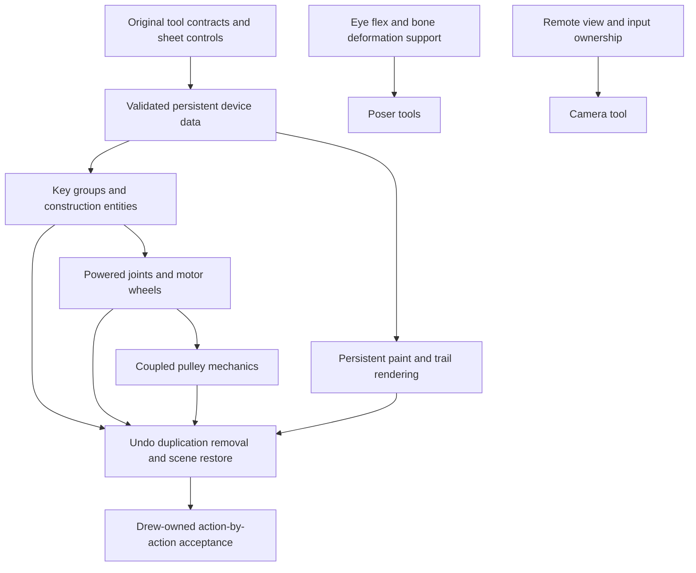

# Remaining tool implementation plan

## Scope and evidence, 2026-09-30

Reviewed the entire 38-row inventory and all 18 private reports. Starting inventory: 13 partial implementations, 22 missing tools, 3 reference-only internal tools. Read the installed read-only original stool scripts for all 22 missing tools, including ClientConVar defaults, LeftClick/RightClick/Reload entry points, entity constructors, key callbacks, constraints and posing APIs. Native scripts remain private Steam content. This is an independent runtime, not execution of those scripts.

## Delivery order

1. Establish persistent typed construction-device configuration and bounded key controls. Preserve old version 2/3/4 scenes using optional new fields. Validate all settings and assets before replacement. Reuse original model spawning, whole-scene undo, connected-assembly removal and duplication.
2. Add balloon lift, thruster forward/reverse force, hoverball altitude control, momentary/toggle buttons, delayed dynamite, bounded spark emitter, point light and spotlight. Left-click attaches where appropriate, right-click creates unattached devices or updates as described by the tool row. Surface placement and forces use authored configuration. Do not invent audio or native particle fidelity.
3. Add motor, hydraulic, muscle and winch constraints driven by configurable keypad controls. Retain local anchors and actual physics joints, persistent configuration, current lengths and group-key behavior. Add motorized wheel construction through the same joint path. Native force-break, solver and cable fidelity remain separate gaps.
4. Add four-anchor pulley routing with actual coupled-length forces and rendered segments. Implement actual mechanics rather than showing a rope with no force.
5. Add persistent trail and paint configuration with bounded runtime geometry, actual materials, remove/reset actions, undo and save/restore. Entity editing must select real supported device settings rather than fake a generic network-property editor.
6. Camera has independent remote-view/input ownership and optional fixed-point aiming, with moving-target tracking and native locking still open. The four poser tools now use per-instance weighted bone transforms, original raw flex vertex deltas and explicit iris projection on compatible model props. Nine authored controls expose the supported subset. Native controller rules, eye shaders, alternate finger skeletons, NPC integration and articulated ragdolls remain separate dependencies.
7. Audit all tools and controls again, update tool-by-tool manual cases and F7 cards, compile the actual game and validate/export the authoritative sheets. Drew owns gameplay acceptance. No tests, screenshots, benchmarks or input automation. Preserve active game processes.

## Acceptance boundaries

Every advertised left/right/reload action and enabled setting needs a concrete runtime consumer. All new status values stay partial until full native behavior and Drew's acceptance exist. Old saves and private feedback must remain intact. Unsupported targets must reject clearly, and lifecycle failures must not destroy the previous scene.

Current delivery after reviewing all 19 private reports: 35 partial rows including custom Freeze and three reference-only entries. The 178 option rows and 52 manual cases are authored in the existing sheets. Version-6 scenes add per-instance bone rotations/scales, raw flex weights and local eye targets while retaining version 2 through 5 and legacy readers. Pose geometry, hulls and supported iris assets are preflighted before scene replacement. This is code integration, not gameplay acceptance. Earlier version-5 scenes added typed devices and paint. Transient device activation/fuses reset to authored start-on state on restore, trail history restarts and muscle phase is not persisted. These choices avoid accidentally detonating a loaded scene and are not native save parity.
