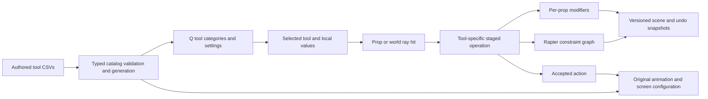

# Stock tool implementation plan

Updated 2026-09-29. Drew owns all testing. Build success is not gameplay acceptance or one-to-one GMod parity.

## Authoritative spreadsheet trail

- `tools.csv` retains the 37 installed stock-tool specification IDs and reference objectives.
- `source_tools.csv` covers every one of those IDs plus the explicitly custom Freeze tool. It drives the categorized Q list, action descriptions and remaining-work text. Build validation rejects missing or extra IDs.
- `tool_reference_options.csv` records 170 literal installed `ClientConVar` defaults, with source file and line. This lexical inventory excludes dynamic declarations, presets, permissions, model lists and native options. It is not a complete settings implementation.
- `source_tool_options.csv` drives 39 settings rows: enabled controls affect current operations, while unsupported controls are visibly disabled. Slider bounds and steps are independently authored unless separately measured.
- `source_toolgun.csv` authors the original fire clip, screen surface/background, render size, text timing, tracer and limits. `source_physics_materials.csv` explicitly labels the independent Rapier coefficients.
- `tool_cases.csv` records the acceptance work left to Drew. No case is marked passed by compilation.
- `work_queue.csv` remains the exhaustive project dependency plan. `parity_gaps.csv` remains the broad fidelity ledger. New sheets refine those records rather than replacing them.

## Implementation sequence and current state

| Order | Work | Current implementation | Still required before complete |
|---|---|---|---|
| 1 | Tool selection and action dispatch | Separate semi-automatic left/right/reload callbacks, prop/world ray hits, tool-specific stages, cancellation on weapon change/focus loss, local settings persistence | Stock permission hooks, ragdoll bone traces, ghost/selection previews, stock help HUD and stage-specific widgets |
| 2 | Toolgun screen and firing | Original `@fire01` viewmodel clip with merged hands after an accepted action, transient tracer, dedicated 256px render target on the original screen material, selected title scrolling | Drew's visual acceptance, original Helvetica metrics/shadow, original ToolTracer effect, sound, third-person attack gesture and revolver hold, draw/holster/reload event sequence |
| 3 | Reversible editing | Colour RGBA apply/sample/reset, material override/sample/reset, physical material/gravity, remover single/connected/constraint-only, custom Freeze | Render modes/FX, full material gallery/shaders, native surface response, removal dissolve/timing, complete eligibility and permissions |
| 4 | Constraint foundation | Weld, axis, ball socket, rope, slider, elastic and pair no-collide, visible straight cable approximation, linked removal, undo/save and assembly duplication | Force/torque breaking, all native options, easy-weld third rotation stage, exact rope geometry/material, relative damping, Source solver response |
| 5 | Actuators | Not implemented: motor, hydraulic, muscle, pulley, winch, wheel | First add authored key-group bindings and tick-driven actuation. Then implement each tool's actual stage flow, defaults, update semantics, previews, modifiers, serialization and cleanup. Pulley needs four-anchor coupling, not a renamed rope |
| 6 | Spawned tool entities | Not implemented: balloon, button, camera, dynamite, emitter, hoverball, lamp, light, thruster, editentity | Shared typed spawned-entity lifecycle, key bindings and use events. Implement physical controllers, camera switching, damage, particles and projected lighting only against their actual behavior. Do not substitute generic props |
| 7 | Render tools | Not implemented: paint, trails | Decal projection/material selection and historical ribbon lifetime/width/texture. Preserve state through duplicate/save and clean up render resources |
| 8 | Posers | Not implemented: eyeposer, faceposer, finger, inflator | Per-bone ragdoll physics, flex data, eye look targets/shaders and model-specific pose controls. Never treat whole-model scaling as bone inflation |
| 9 | Content and internal tools | Creator remains reference-only; example and leafblower remain separately classified | Creator dispatch depends on implemented content classes and permissions. Inspect actual availability of internal/legacy tools before advertising them |
| 10 | Full compatibility and acceptance | Local version-2 scene document preserves supported prop modifiers and links; old prop-array saves still read | Stock dupe/save formats, other entity types, velocities, grouped/per-player undo, networking, native Lua/tool callbacks and all acceptance cases |

There are **12 stock tool subsets plus custom Freeze**, not 37 finished tools. The remaining 22 ordinary stock tools are unimplemented, and three installed internal/reference entries are not advertised as functional. Every implemented stock entry remains `partial`/`prototype`.

## Current control contract

Hold Q, select Tools, choose a tool, edit enabled controls, release Q to use it. `2` equips the current tool, `1` equips the physgun. Left/right/R have the meanings displayed for that tool, not a universal right-click freeze behavior. Two-target tools retain the first hit in local body coordinates. R clears an unfinished stage even when aiming at empty sky. Changing weapons/tools or losing focus clears the stage. Opening Q preserves it so settings can be adjusted.

- Weld left preserves placement. Its current right-click path aligns the first selected surface and welds on the second click. Stock easy-weld's final rotation click is still missing.
- Axis left aligns surfaces; right creates the hinge without moving the first body. Both clicks must use the same button.
- Rope right-click chaining retains the most recent anchor. Rope width/added length use Source units converted to the existing world scale. Rigid rope is a solver distance limit, not the native rope implementation.
- Duplicator right copies the connected prop graph and modifiers. Left pastes at the hit position. R clears the clipboard. No stock ghost preview or rotation-placement UI exists yet.
- Z uses whole-scene snapshots, including supported links and modifiers. It is not GMod's operation-group undo and rewinds unrelated prop transforms.
- F5 creates a new local scene file. F6 loads the latest local scene. Asset preparation and validation precede removal of the live props. Existing files are never rewritten. This is not proof of transactional recovery from every possible runtime failure.

## Architecture and safety

Properties use independent material handles, not shared cached-prop mutation. World, props and player have distinct collision memberships. Pair no-collide uses an unlocked joint with contacts disabled, while world-only collision is a separate per-prop filter. Links are parented under a rigid body for Rapier, and both world and restored anchor bodies carry visibility for cable children. A failed weapon asset switch cleans up partial actors and retains the previous weapon instead of retrying and leaking actors every frame. Prop and joint limits apply to duplicate as well as direct creation. Stretch-only elastic updates only rewrite the physics joint when the motor parameters actually change.

## Acceptance policy

No tests, benchmark runs, smoke input, screenshot capture or gameplay automation are run by the agent. Compile and normal launch are allowed. Drew's results belong in `tool_cases.csv` with evidence, not inferred from compilation or code inspection. The next implementation work should follow the remaining rows above, with actual callback/settings research before each tool is enabled.
