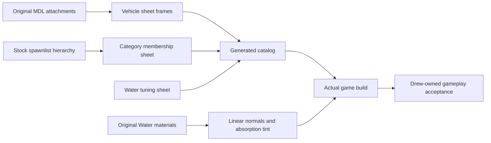

# Vehicle orientation, categories and water correction

## Requested outcome

Correct reported sideways airboat driving and seating, real model categories and poor/blinking water. Continue the sheet-owned remaining-feature backlog without presenting prototypes as a complete Source engine.

## Evidence and plan

1. Preserve the live game, saves and local feedback. Inspect source and original mounted metadata without running tests or automated gameplay.
2. Resolve original `vehicle_driver_eyes` and `vehicle_feet_passenger0` through the bind bone hierarchy for every registered model. Four powered models face converted +X, not Bevy -Z. Chairs face -Z. Pod eyes face +X and have no feet attachment.
3. Author `forward_yaw`, seat coordinates and per-model eye height in source_vehicles.csv. Use the same frame for spawn rotation, propulsion, lateral grip, suspension ray placement and entry camera. Keep saved object transforms unchanged. Body seat_yaw follows original attachment heading.
4. Extract all 43 installed default spawnlists, including parent hierarchy and section headers, into source_model_categories.csv. Preserve multiple memberships and only show mounted models. Parent selection includes descendants and expands the active hierarchy branch with short indented labels. Unlisted models receive readable folder fallbacks, never filename categories.
5. Classify water by parsed Water shader rather than the substring water. Use original linear normal textures with tangents and moving UVs, Bevy's existing transmissive PBR path, original fog color as absorption tint and a single two-sided above-water boundary. Do not render both coplanar original above/below variants simultaneously.
6. Compile the actual executable in the private target directory under a new name. Validate production sheet loading and export a new workbook. Preserve all 14 correction cases as Drew-owned not_run until real acceptance.
7. Commit reviewed code, sheets and research, then publish. Do not stop or replace the live game.

## Boundaries and remaining order

The attachment positions are bind-pose evidence, not native animated entry sequences. Pod feet height is estimated from its eye attachment. Small horizontal eye offsets and seated animation root alignment remain unverified. Chassis suspension, water support and steering tuning are still independent approximations.

The renderer reuses Bevy rather than adding a custom shader/dependency. It does not implement Source planar reflections, native animated VTF frame playback, screen-space depth fog, underwater volumes, caustics or native material proxies. Only authored moving UVs are animated. Suppressing the separate underwater material deliberately uses the same boundary from either side.

The wider work remains in work_queue.csv, parity_gaps.csv, spawn_capabilities.csv and playable_coverage.csv: NPC AI and generic entities; remaining 21 weapons and native secondary/damage/audio; actual vehicle scripts and model wheel/fan animations; complete tools; native menu interactions and settings; physics/renderer fidelity; networking/Lua/platform compatibility. This pass does not mark these packages complete. Resolve reported regressions before expanding more unaccepted prototype routes.
